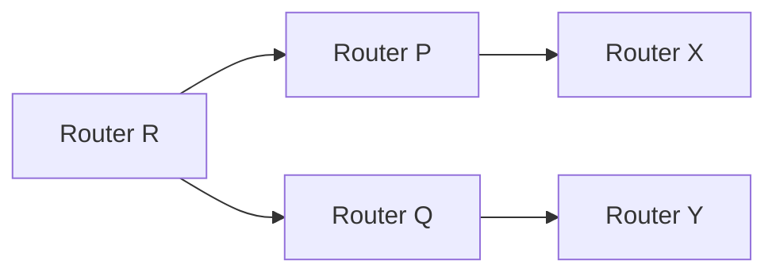
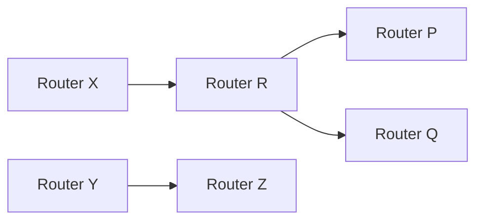

**Routing Protocol Theory Note**
=====================================

**Introduction**
---------------

Routing protocols are used to exchange routing information between routers in a computer network, enabling them to determine the best path for forwarding packets. This note focuses on distance vector routing algorithms, which are a common type of routing protocol.

**Core Concepts**
-----------------

### Distance Vector Routing Algorithm

The distance vector routing algorithm is a type of routing protocol that uses the Bellman-Ford algorithm to calculate the shortest path from each router to every other router in the network. Each router maintains a routing table that contains the minimum cost (distance) to reach every other router.

### Routing Table

A routing table is a data structure maintained by each router that stores the minimum cost to reach every other router in the network. The routing table includes the following information:

* Destination IP address
* Next hop IP address (the next router on the path)
* Cost (distance) to reach the destination

### Routing Vectors

Routing vectors are messages sent between routers that contain the routing table of the sending router. Routing vectors are used to update the routing tables of neighboring routers.

**Key Formulas/Theorems**
-------------------------

The Bellman-Ford algorithm is used to calculate the shortest path from each router to every other router in the network. The algorithm can be represented by the following formula:

`d(v, w) = min(d(v, u) + c(u, w))`

where `d(v, w)` is the minimum cost to reach node `w` from node `v`, `c(u, w)` is the cost of the edge between nodes `u` and `w`, and `d(v, u)` is the minimum cost to reach node `u` from node `v`.

**Problem Solving Patterns**
---------------------------

### Example 1: Distance Vector Routing Algorithm

Consider a network with three routers (R, P, Q) and four edges between them. The costs of the edges are:

| Edge | Cost |
| --- | --- |
| R -> P | 2 |
| R -> Q | 3 |
| P -> Q | 1 |

Router R maintains a routing table that contains the minimum cost to reach every other router. After receiving routing vectors from its neighbors, Router R updates its routing table as follows:

* Destination: P
	+ Next hop: P
	+ Cost: 2
* Destination: Q
	+ Next hop: Q
	+ Cost: 3

### Example 2: Routing Vectors

Router X maintains a routing table that contains the minimum cost to reach every other router. After receiving routing vectors from its neighbors, Router X updates its routing table as follows:

* Destination: P
	+ Next hop: R
	+ Cost: 5 (R -> P + 3)
* Destination: Q
	+ Next hop: R
	+ Cost: 6 (R -> Q + 4)

**Examples with Solutions**
---------------------------

### Example 1

Consider the network topology shown below:

Router R measures its distance to its neighbors as follows:

* Distance to P: 2
* Distance to Q: 3

Router R receives routing vectors from its neighbors that indicate the following distances:

* Router X to P: 5
* Router Y to Q: 4

Using the Bellman-Ford algorithm, Router R updates its routing table as follows:

* Destination: P
	+ Next hop: P
	+ Cost: 2
* Destination: Q
	+ Next hop: Q
	+ Cost: 3

### Example 2

Consider the network topology shown below:

Router X maintains a routing table that contains the minimum cost to reach every other router. After receiving routing vectors from its neighbors, Router X updates its routing table as follows:

* Destination: P
	+ Next hop: R
	+ Cost: 5 (R -> P + 3)
* Destination: Q
	+ Next hop: R
	+ Cost: 6 (R -> Q + 4)

**Common Pitfalls**
------------------

* Failing to update the routing table correctly after receiving new information from neighbors.
* Not using the Bellman-Ford algorithm to calculate the shortest path.

**Quick Summary**
----------------

* Distance vector routing algorithm uses the Bellman-Ford algorithm to calculate the shortest path.
* Routing table contains the minimum cost to reach every other router.
* Routing vectors are used to update the routing tables of neighboring routers.
* Bellman-Ford algorithm can be represented by the formula `d(v, w) = min(d(v, u) + c(u, w))`.