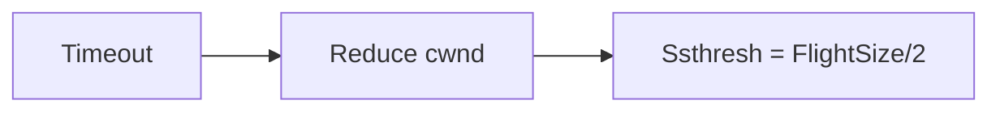

**Transport Layer TCP**
======================

**Introduction**
---------------

The Transport Layer of the OSI model provides reliable data transfer between devices over a network. TCP (Transmission Control Protocol) is one such protocol that ensures error-free and ordered delivery of data segments. In this note, we will focus on understanding the behavior of TCP in relation to congestion windows, timeout, and slow start.

**Core Concepts**
-----------------

### Congestion Window

The congestion window (cwnd) is a mechanism used by TCP to prevent network congestion. It determines the amount of unacknowledged data that can be sent before receiving an acknowledgment from the receiver. The initial value of cwnd is typically 1 MSS (Maximum Segment Size).

### Slow Start

Slow start is a technique used by TCP to adapt to changing network conditions. When the congestion window is reduced due to packet loss or timeout, the slow start algorithm increases the cwnd by half for each RTT (Round Trip Time) until it reaches the maximum threshold.

### Timeout and Retransmission

Timeout occurs when the sender does not receive an acknowledgment within a certain time limit (typically 200 ms). When a timeout happens, the congestion window is reduced to 1 MSS, and the slow start algorithm begins again. The sender retransmits all unacknowledged packets in subsequent RTTs.

**Key Formulas/Theorems**
-------------------------

*   Congestion Window Size (cwnd) = Minimum of ( Slow Start Threshold, FlightSize )
    \[ cwnd = min\left(\frac{FlightSize}{2}, ssthresh\right) \]

where FlightSize is the amount of data sent since the last acknowledgment.

### Example with Solution

Consider a TCP connection operating at a point in time with a congestion window size (cwnd) of 12 MSS. When a timeout occurs due to packet loss:

*   Initial cwnd = 12 MSS
*   After timeout, cwnd = 1 MSS (reduce to minimum)
*   After 1 RTT: cwnd = 1 MSS (slow start phase begins)
*   After 2 RTTs: cwnd = 2 MSS (cwnd doubles for each RTT in slow start phase)
*   After 3 RTTs: cwnd = 4 MSS

**Problem Solving Patterns**
---------------------------

When faced with questions related to TCP congestion windows and timeouts, follow these steps:

1.  Identify the initial value of cwnd.
2.  Determine if a timeout has occurred.
3.  If yes, apply the slow start algorithm:
    *   Reduce cwnd to minimum (usually 1 MSS).
    *   Double cwnd for each RTT until it reaches the ssthresh.

**Common Pitfalls**
-------------------

*   Failing to account for the initial value of cwnd.
*   Misunderstanding the slow start algorithm and its impact on congestion window size.
*   Forgetting to update the FlightSize when calculating cwnd.

**Quick Summary**
-----------------

| Concept | Description |
| --- | --- |
| Congestion Window (cwnd) | Mechanism to prevent network congestion. Initial value = 1 MSS. |
| Slow Start | Technique to adapt to changing network conditions. Increases cwnd by half for each RTT. |
| Timeout and Retransmission | Reduces cwnd to minimum (usually 1 MSS), then applies slow start algorithm. |

This comprehensive note covers the essential concepts, formulas, and problem-solving strategies related to TCP congestion windows and timeouts. By following this guide, you'll be well-prepared to tackle questions on this topic in the GATE CS exam.