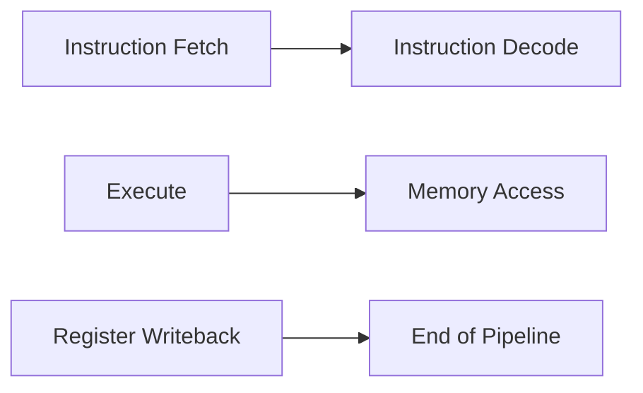

**Instruction Pipelining**
=========================

### Introduction

Pipelining is a technique used to improve the throughput of a processor by dividing its execution into a series of stages, each executing a specific task. Instruction pipelining involves breaking down the instruction execution process into a pipeline of stages, allowing for concurrent execution of instructions.

### Core Concepts

In a 5-stage pipelined processor with Instruction Fetch (IF), Instruction Decode (ID), Execute (EX), Memory Access (MEM), and Register Writeback (WB) stages, each stage performs a specific task:

1. **Instruction Fetch (IF)**: Retrieves the next instruction from memory.
2. **Instruction Decode (ID)**: Decodes the instruction and identifies the operation to be performed.
3. **Execute (EX)**: Performs the actual execution of the instruction.
4. **Memory Access (MEM)**: Accesses main memory for load or store operations.
5. **Register Writeback (WB)**: Writes the results of the instruction back to registers.

### Key Formulas/Theorems

N/A

### Problem Solving Patterns

1. **Understanding Pipeline Stages**: Identify the stages involved in the pipeline and determine which stage is causing a stall or bottleneck.
2. **Forwarding**: Recognize when forwarding is necessary and how it affects pipeline stages.
3. **Hazards**: Identify potential hazards, such as data hazards, control hazards, and structural hazards.

### Examples with Solutions

**Example 1:** A pipelined processor has the following instructions:

`IF: ADD R2, R3, R4`
`ID: SUB R5, R6, R7`

Assuming a 5-stage pipeline, where stage 1 is IF, stage 2 is ID, and so on.

| Stage | Instruction | Result |
| --- | --- | --- |
| IF (Stage 1) | ADD R2, R3, R4 | - |
| ID (Stage 2) | SUB R5, R6, R7 | - |
| EX (Stage 3) |  ? | - |
| MEM (Stage 4) | ? | - |
| WB (Stage 5) | ? | ? |

What is the result of the ADD instruction?

`Solution:` Since the ID stage for the SUB instruction is still in progress, we need to forward the results from the EX stage of the previous instruction. The correct result for the ADD instruction is:

`R2 = R3 + R4`

**Example 2:** A pipelined processor has the following instructions:

`IF: LOAD R1, MEM[100]`
`ID: STORE R2, MEM[200]`

Assuming a 5-stage pipeline.

| Stage | Instruction | Result |
| --- | --- | --- |
| IF (Stage 1) | LOAD R1, MEM[100] | - |
| ID (Stage 2) | STORE R2, MEM[200] | - |
| EX (Stage 3) | ? | - |
| MEM (Stage 4) | ? | - |
| WB (Stage 5) | ? | ? |

What is the result of the LOAD instruction?

`Solution:` Since the ID stage for the STORE instruction is still in progress, we need to forward the results from the MEM stage of the previous instruction. However, this instruction accesses memory, so it will stall until the next clock cycle.

### Common Pitfalls

1. **Forgetting to handle hazards**: Ensure that all potential hazards are addressed and pipeline stages are correctly executed.
2. **Misunderstanding forwarding**: Be aware of when forwarding is necessary and how it affects pipeline stages.

### Quick Summary

* Pipelining: Divide instruction execution into a series of stages for concurrent execution.
* Pipeline stages:
	+ Instruction Fetch (IF)
	+ Instruction Decode (ID)
	+ Execute (EX)
	+ Memory Access (MEM)
	+ Register Writeback (WB)
* Forwarding: Pass results from source stage of earlier instruction to destination stage of later instruction.
* Hazards: Identify potential hazards and address them to maintain pipeline integrity.

### Mermaid Diagram

This diagram illustrates the basic stages involved in a 5-stage pipelined processor.