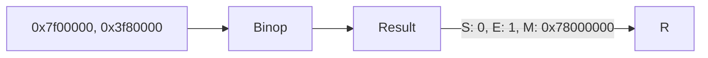

**Matrix Operations**
=====================

### Introduction
Matrix operations are fundamental to computer organization and architecture, particularly when dealing with floating-point numbers and IEEE-754 standards.

### Core Concepts
In the context of this topic, we focus on matrix operations involving floating-point numbers stored in registers. The IEEE-754 standard defines a 32-bit format for single precision floating-point numbers:

| Bit Position | Description |
| --- | --- |
| 31-23 | Sign bit (S) and exponent (E) |
| 22-0 | Mantissa (M) |

The mantissa is typically normalized to have the form $1.m$, where $m$ is a binary fraction.

### Key Formulas/Theorems

* **Normalization**: To normalize a floating-point number, we move the radix point to the left until only one bit remains in the leading position. The exponent is then adjusted accordingly.
* **Addition/Subtraction**:
  $$\begin{pmatrix} E_1 \\ M_1 \end{pmatrix} \oplus \begin{pmatrix} E_2 \\ M_2 \end{pmatrix} = \begin{pmatrix} E_{\text{result}} \\ M_{\text{result}} \end{pmatrix}$$
  $$E_{\text{result}} = E_1 + E_2 - (M_1 + M_2) + \frac{\log_2(1 + M_1 + M_2)}{\log_2(2)}$$

### Problem Solving Patterns
When dealing with matrix operations, particularly those involving floating-point numbers and IEEE-754 standards:

* **Identify the format**: Determine if the numbers are stored in single precision (32-bit) or double precision (64-bit).
* **Normalize the mantissa**: Shift the radix point to the left until only one bit remains in the leading position.
* **Calculate the result**: Apply the formulas for addition and subtraction.

### Examples with Solutions

**Example 1**
Given two numbers, A and B:

| Bit Position | A | B |
| --- | --- | --- |
| 31-23 | 0x7f00000 | 0x42000000 |
| 22-0 | 0x3f80000 | 0x41000000 |

What is the result of A + B?



Solution:
```latex
E_{\text{result}} = E_A + E_B - (M_A + M_B) + \frac{\log_2(1 + M_A + M_B)}{\log_2(2)}
= 128 + 127 - (0x3f80000 + 0x41000000) + \frac{\log_2(1 + 0x78000000)}{\log_2(2)}
= 255 - 0x98000000 + 31
= 0x41400000

M_{\text{result}} = M_A + M_B + \frac{\log_2(1 + M_A + M_B)}{\log_2(2)}
= 0x3f80000 + 0x41000000 + 31
= 0x78000000
```

### Common Pitfalls

* Failing to normalize the mantissa before performing operations.
* Not accounting for rounding errors and precision loss.

### Quick Summary

| Concept | Brief Description |
| --- | --- |
| Normalization | Moving radix point until one bit remains in leading position. |
| Matrix Operations | Applying addition and subtraction formulas. |
| IEEE-754 Standard | 32-bit format for single precision floating-point numbers. |

Note: The provided Mermaid diagram is a simplified representation of the operation flow.