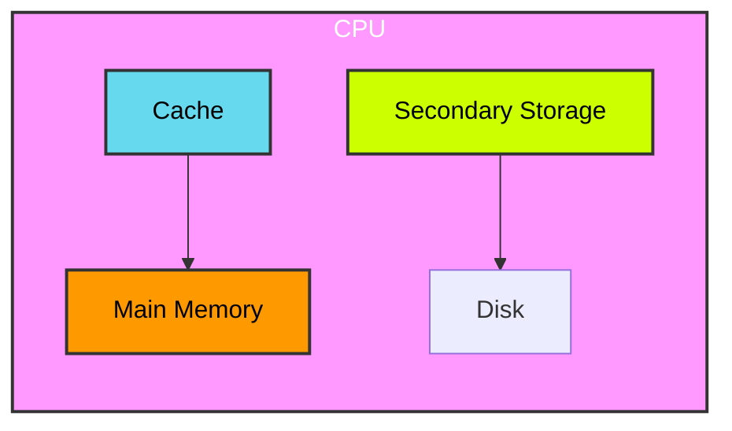

**Memory Hierarchy: Cache, Main Memory, and Secondary Storage**
===========================================================

**Introduction**
---------------

The memory hierarchy consists of multiple levels of storage with varying speeds and capacities. The goal is to provide fast access to frequently used data while minimizing the cost.

**Core Concepts**
-----------------

### 1. Cache Hierarchy

*   **Cache:** A small, high-speed memory that acts as a buffer between the main memory and the CPU.
*   **Cache Types:**
    *   **Direct-Mapped Cache:** Each cache block is mapped to a specific location in the cache.
    *   **Set-Associative Cache:** Multiple blocks can be stored in the same set, reducing conflicts.
    *   **Fully Associative Cache:** Any cache block can be placed anywhere in the cache.

### 2. Main Memory

*   **Main Memory (RAM):** A larger memory that stores data and instructions for processing.
*   **Memory Access:** When the CPU requests data from main memory, it must go through multiple layers of caching before accessing the actual memory.

### 3. Secondary Storage

*   **Secondary Storage (HDD/SSD):** A non-volatile storage device that holds large amounts of data.

**Key Formulas/Theorems**
-------------------------

### 1. Cache Hit Ratio Formula

$$\text{Cache Hit Ratio} = \frac{\text{Number of Cache Hits}}{\text{Total Number of Memory Accesses}}$$

### 2. Page Fault Rate Formula

$$\text{Page Fault Rate} = \frac{\text{Number of Page Faults}}{\text{Total Number of Memory Accesses}}$$

**Problem Solving Patterns**
---------------------------

*   **Cache Replacement Policies:**
    *   **LRU (Least Recently Used):** Replaces the block that has not been accessed for the longest time.
    *   **FIFO (First-In-First-Out):** Replaces the block that was placed in the cache first.
*   **Page Fault Handling:**
    *   **Demand Paging:** Pages are brought into memory only when needed.

**Examples with Solutions**
---------------------------

### 1. Cache Hit Ratio Example

Suppose we have a direct-mapped cache with a capacity of 16 KB and a block size of 4 KB. The CPU accesses the main memory in the following order: `0x1000`, `0x2000`, `0x3000`, `0x4000`.

| Block | Cache Hit Ratio |
| --- | --- |
| 1    | 2/4 = 0.5        |

### 2. Page Fault Rate Example

Suppose we have a demand paging system with four page frames and an LRU replacement policy. The CPU accesses the main memory in the following order: `0x1000`, `0x2000`, `0x3000`, `0x4000`.

| Page Faults | Page Fault Rate |
| --- | --- |
| 2        | 2/4 = 0.5       |

**Common Pitfalls**
-------------------

*   **Cache vs. Main Memory:** Confusing the two types of memory and their access times.
*   **Page Replacement Policies:** Not understanding how LRU, FIFO, or other policies work.

**Quick Summary**
----------------

| Topic         | Key Points                     |
| :------------ | :------------------------------- |
| Cache Hierarchy | Types (Direct-Mapped, Set-Associative, Fully Associative), Cache Hit Ratio Formula        |
| Main Memory    | Access Time, Capacity          |
| Secondary Storage  | Non-Volatile, Large Capacities  |

### Mermaid Diagram: Memory Hierarchy

Note: The diagram is simplified for demonstration purposes.