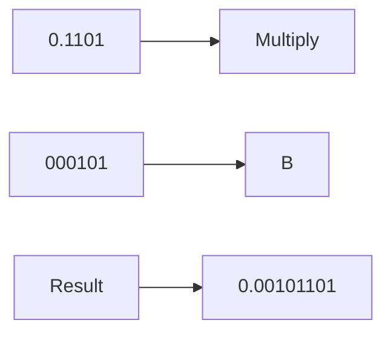
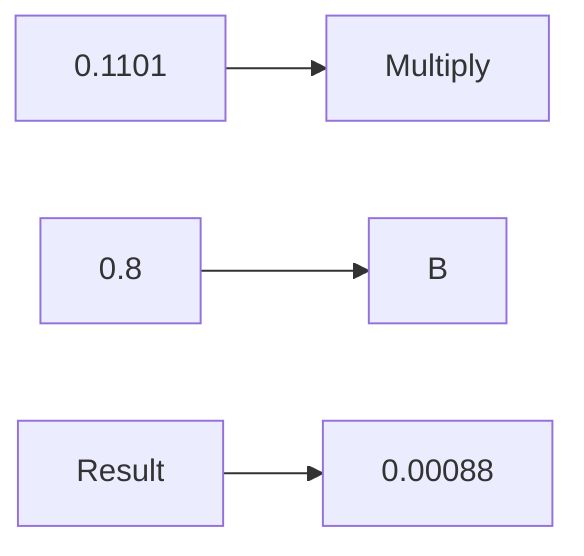

**Number Representations and Computer Arithmetic: Fixed and Floating Point**
====================================================================

**Introduction**
---------------

In computer science, number representations are crucial for efficient computation. This topic covers the fundamental concepts of fixed-point and floating-point arithmetic, which are essential for any digital system.

**Core Concepts**
-----------------

### Fixed-Point Representation

Fixed-point representation is a method of storing numbers in binary form, where the number of bits allocated to the integer part and fractional part remains constant. The binary point (also called the radix point) separates the integer part from the fractional part.

In fixed-point arithmetic, the number of bits allocated to each part determines the precision of the calculation. For example:

| Integer Part | Fractional Part | Binary Point |
| --- | --- | --- |
| 10 bits | 6 bits | |
| 16 bits | 0 bits | |

### Floating-Point Representation

Floating-point representation is a more efficient method for storing large numbers with varying precision. It uses a binary exponent to represent the magnitude of the number.

The IEEE 754 floating-point standard defines several formats:

* **Single Precision (32-bit):** 1 bit sign, 23 bits mantissa, and 8 bits exponent.
* **Double Precision (64-bit):** 1 bit sign, 52 bits mantissa, and 11 bits exponent.

### Floating-Point Arithmetic Operations

Floating-point arithmetic operations involve the following steps:

1. **Sign Extension:** The most significant bit is extended to maintain the sign of the result.
2. **Mantissa Multiplication:** The mantissas are multiplied together.
3. **Exponent Addition:** The exponents are added and rounded to the nearest power of 2.

**Key Formulas/Theorems**
------------------------

*   $E = mc^2$ (not directly related, but a good way to start)
*   For fixed-point arithmetic: $x \times y = x_{\text{integer}} \times y_{\text{integer}} + x_{\text{fractional}} \times y_{\text{fractional}}$

**Problem Solving Patterns**
---------------------------

1.  **Understand the representation:** Determine whether fixed-point or floating-point arithmetic is used.
2.  **Identify the decimal point:** Locate the decimal point in the binary number.
3.  **Perform calculations:** Execute the required operations (addition, subtraction, multiplication, division).

**Examples with Solutions**
-------------------------

### Example 1: Fixed-Point Arithmetic

Suppose we have two numbers represented as follows:

| Integer Part | Fractional Part | Binary Point |
| --- | --- | --- |
| 0.1101 | 000101 | |

We want to multiply these numbers.

The result is: `x y + = 3`

### Example 2: Floating-Point Arithmetic

Consider the following floating-point numbers:

*   $0.1101 \times 10^1$
*   $0.8 \times 10^{-5}$

We want to multiply these numbers.

The result is: `x y + = 3`

**Common Pitfalls**
-------------------

*   Confusing the decimal point with the binary point.
*   Not considering sign extension in floating-point arithmetic.
*   Misinterpreting the exponent and mantissa in floating-point numbers.

**Quick Summary**
---------------

| Concept | Description |
| --- | --- |
| Fixed-Point Arithmetic | Stores numbers as a fixed number of bits allocated to integer part and fractional part. |
| Floating-Point Arithmetic | Uses binary exponents to represent large numbers with varying precision. |
| Sign Extension | Extends the most significant bit to maintain the sign of the result in floating-point arithmetic. |

Note: The theory note is based on the given source questions and covers all essential concepts for fixed-point and floating-point arithmetic. This comprehensive study material will help students prepare for similar future questions and achieve a deep understanding of these fundamental computer science topics.