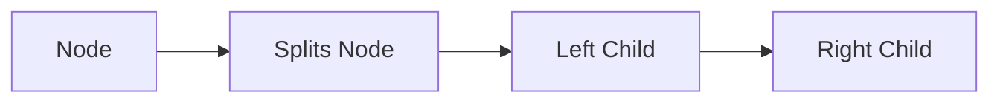

**Dynamic Hashing Approach for Integer Keys**
==============================================

### Introduction
-----------------

The dynamic hashing approach is a technique used to manage hash tables with high collision rates. It is particularly useful when dealing with large datasets and integer keys. The core idea is to use a combination of hashing and tree-based data structures to efficiently store and retrieve key-value pairs.

### Core Concepts
-----------------

#### 1. Hash Table Size

The main hash table size is typically set to a power of 2 (e.g., 4, 8, 16). This allows for efficient indexing using bitwise operations.

#### 2. Hash Function

The hash function takes an integer key as input and produces a hash value between 0 and the main hash table size minus one. In this approach, only the 2 least significant bits of the key are used to index into the main hash table.


#### 3. Collision Resolution

When two keys collide, a binary tree is created to store the set of all keys corresponding to a main hash table entry.


#### 4. Splitting Nodes

Each node in the binary tree is further sub-divided into left and right subtrees based on the next least significant bit.



### Key Formulas/Theorems
---------------------------

* None

### Problem Solving Patterns
---------------------------

1. **Identify the collision resolution strategy**: Determine how the dynamic hashing approach resolves collisions.
2. **Analyze the hash function**: Understand how the 2 least significant bits of the key are used to index into the main hash table.
3. **Visualize the binary tree structure**: Recognize how each node is further sub-divided based on the next least significant bit.

### Examples with Solutions
---------------------------

**Example 1**

Suppose we have a dynamic hash table with a main size of 4 and the following keys:

| Key | Hash Value |
| --- | --- |
| 12  | 0         |
| 13  | 1         |
| 15  | 2         |

To resolve collisions, we create a binary tree for each main hash table entry.

```markdown
+---+
|   |       +---+    +---+
|   |       |   |    |   |
| 12|       | 13|    | 15|
+---+       +---+    +---+
```

**Example 2**

Suppose we have a dynamic hash table with a main size of 8 and the following keys:

| Key | Hash Value |
| --- | --- |
| 123 | 0         |
| 125 | 1         |

To resolve collisions, we create a binary tree for each main hash table entry.

```markdown
+---+
|   |       +---+    +---+
|   |       |   |    |   |
| 123|       | 125|    |
+---+       +---+
     |
     +---+
     |   |
     | 127|
     +---+
```

### Common Pitfalls
-------------------

1. **Ignoring the 2 least significant bits**: Failing to use these bits for indexing into the main hash table.
2. **Not creating a binary tree**: Not organizing keys corresponding to each main hash table entry as a binary tree.

### Quick Summary
-----------------

* Dynamic hashing approach uses a combination of hashing and tree-based data structures.
* Main hash table size is typically set to a power of 2 (e.g., 4, 8, 16).
* Collision resolution strategy involves creating a binary tree for each main hash table entry.
* Node splitting occurs based on the next least significant bit.