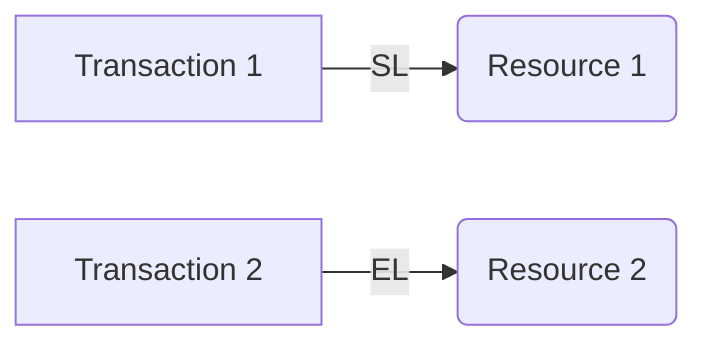
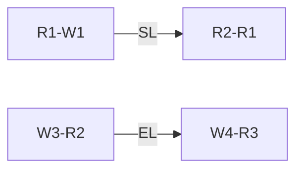

**Transactions and Concurrency Control**
=====================================

**Introduction**
---------------

Concurrency control is a crucial aspect of database design, ensuring that multiple transactions can execute simultaneously without interfering with each other's data. In this note, we will delve into the fundamental concepts, laws, and algorithms governing transactions and concurrency control.

**Core Concepts**
-----------------

### 1. **Transactions**

A transaction is a sequence of operations executed as a single, atomic unit of work. It has four essential properties:

*   **Atomicity**: A transaction is treated as an indivisible unit; either all or none of its operations are executed.
*   **Consistency**: The database remains in a consistent state after the execution of a transaction.
*   **Isolation**: Concurrent transactions do not affect each other's outcome.
*   **Durability**: Once a transaction has been committed, its effects are permanent.

### 2. **Locking Mechanisms**

To ensure isolation and prevent conflicts between concurrent transactions, locking mechanisms are employed:

*   **Shared Lock (SL)**: Allows multiple transactions to read the locked resource simultaneously.
*   **Exclusive Lock (EL)**: Prevents any other transaction from accessing the locked resource until it is released.

### 3. **Concurrent Schedule**

A concurrent schedule represents a sequence of operations executed by multiple transactions in parallel:

### 4. **Conflict Graph**

A conflict graph represents the dependencies between concurrent operations in a schedule:

**Key Formulas/Theorems**
-------------------------

None specific to this topic.

**Problem Solving Patterns**
---------------------------

### 1. **Identify Conflict**

To determine if two operations conflict, check if one operation's read or write access is incompatible with the other's:

*   Read-Write Conflict: $R_i \rightarrow W_j$
*   Write-Read Conflict: $W_i \rightarrow R_j$

### 2. **Construct Conflict Graph**

Represent dependencies between concurrent operations in a schedule as edges in a conflict graph.

**Examples with Solutions**
---------------------------

### Example 1:

Consider two transactions, T1 and T2, executing concurrently:

To determine if the schedule is conflict-free, construct a conflict graph and check for any incompatibilities.

### Example Solution:

Construct the conflict graph:

Since there are no direct conflicts between operations, the schedule is conflict-free.

**Common Pitfalls**
------------------

*   Failing to identify potential conflicts between concurrent operations.
*   Misunderstanding locking mechanisms and their implications on concurrency control.

**Quick Summary**
-----------------

*   Transactions: atomicity, consistency, isolation, durability
*   Locking mechanisms: shared locks, exclusive locks
*   Concurrent schedule: represents multiple transactions executing in parallel
*   Conflict graph: dependencies between concurrent operations

Note that this is a comprehensive theory note on transactions and concurrency control. Please let me know if you need any modifications or further assistance!