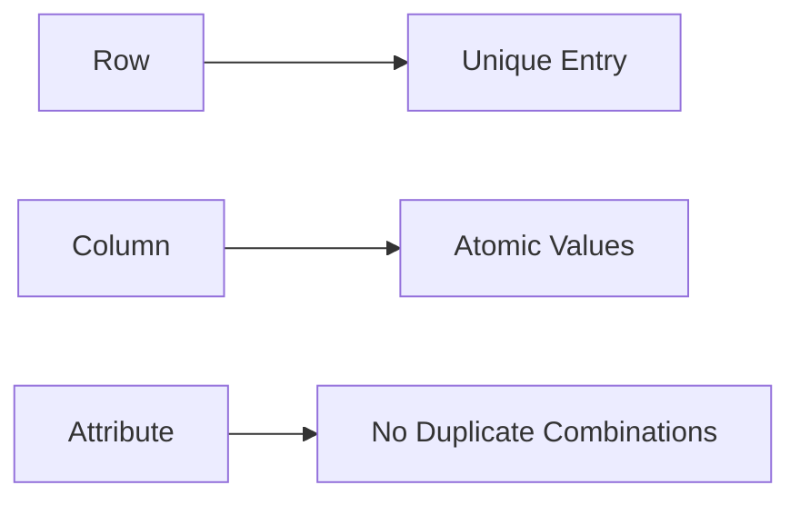

**Database Design Function**
==========================

### Introduction

A relation R in first normal form (1NF) is a table that satisfies certain conditions, making it suitable for storing and managing data. The key concepts related to 1NF are candidate keys, primary keys, foreign keys, and composite attributes.

### Core Concepts

#### First Normal Form (1NF)

A relation R is in 1NF if:

* Each row in the table represents a unique entry.
* Each column contains atomic values only (no repeating groups or arrays).
* There is no duplicate combination of attribute values.



#### Candidate Keys

A candidate key is a minimal set of attributes that uniquely identifies each row in the table. A relation can have multiple candidate keys.

```markdown
**Example:**

Suppose we have a table `Employee` with columns `EmpID`, `Name`, and `Dept`.

| EmpID | Name  | Dept |
| --- | --- | --- |
| 1    | John  | HR   |
| 2    | Jane  | IT   |

In this case, both `EmpID` and the combination of `Name` and `Dept` are candidate keys.
```

#### Primary Keys

A primary key is a candidate key chosen as the unique identifier for each row in the table.

```markdown
**Example:**

Suppose we choose `EmpID` as the primary key.

| EmpID | Name  | Dept |
| --- | --- | --- |
| 1    | John  | HR   |
| 2    | Jane  | IT   |

Now, each row is uniquely identified by its `EmpID`.
```

#### Foreign Keys

A foreign key is an attribute in a table that references the primary key of another table.

```markdown
**Example:**

Suppose we have two tables: `Employee` and `Department`.

| EmpID | Name  | DeptID |
| --- | --- | --- |
| 1    | John  | 101   |
| 2    | Jane  | 102   |

In this case, `DeptID` in the `Employee` table is a foreign key referencing the primary key of the `Department` table.
```

#### Composite Attributes

A composite attribute is an attribute that consists of multiple values.

```markdown
**Example:**

Suppose we have a table `Order` with columns `OrderID`, `Product1`, `Price1`, and `Product2`, `Price2`.

| OrderID | Product1 | Price1 | Product2 | Price2 |
| --- | --- | --- | --- | --- |
| 1    | Apple   | $10   | Orange  | $20   |

In this case, `Product1` and `Price1` are composite attributes.
```

### Key Formulas/Theorems

None applicable.

### Problem Solving Patterns

* Identify candidate keys and primary keys in a relation.
* Determine whether a relation is in 1NF based on the presence of repeating groups or arrays.
* Analyze foreign key relationships between tables.

### Examples with Solutions

**Q1 (ID: cs_2024-M_22)**:

Which of the following statements about a relation R in first normal form (1 NF) is/are TRUE?

(A) R can have a multi-attribute key
(B) R cannot have a foreign key
(C) R cannot have a composite attribute
(D) R cannot have more than one candidate key

**Solution:**

The correct options are A and C.

* A relation R in 1NF can indeed have a multi-attribute key, as demonstrated by the example where `Name` and `Dept` form a candidate key.
* A relation R in 1NF cannot have a composite attribute, as this would violate the definition of 1NF. However, it's worth noting that some sources may allow composite attributes if properly normalized.

### Common Pitfalls

* Failing to distinguish between candidate keys and primary keys.
* Confusing foreign key relationships with composite attributes.
* Assuming that all tables must have a single primary key.

### Quick Summary

* First normal form (1NF) requires each row to be unique, each column to contain atomic values only, and no duplicate combinations of attribute values.
* Candidate keys are minimal sets of attributes that uniquely identify each row in the table. Relations can have multiple candidate keys.
* Primary keys are chosen as the unique identifier for each row in the table.
* Foreign keys reference primary keys in other tables.
* Composite attributes consist of multiple values and are not allowed in 1NF.

Remember to review and practice problems related to database design functions, especially those dealing with first normal form (1NF) and its implications on candidate keys, primary keys, foreign keys, and composite attributes.