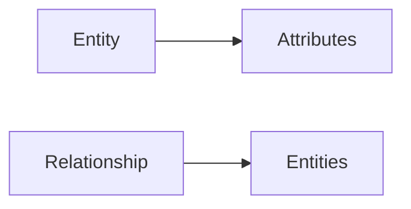
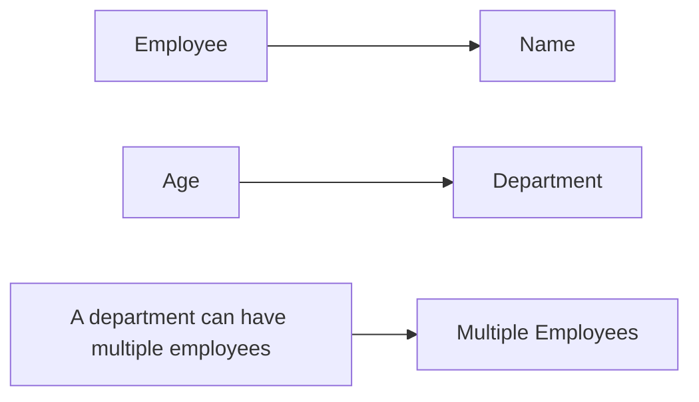

**Entity-Relationship (ER) Model and Relational Model**
======================================================

**Introduction**
---------------

The Entity-Relationship (ER) model and Relational model are two fundamental concepts in database design. The ER model represents data as entities, attributes, and relationships, while the Relational model organizes data into tables with rows and columns.

**Core Concepts**
-----------------

### Entity-Relationship Model

*   **Entity**: A person, place, thing, or concept about which data is stored.
*   **Attribute**: A characteristic of an entity.
*   **Relationship**: A connection between entities.

**Mermaid Diagram: ER Model Structure**



### Relational Model

*   **Table (Relation)**: Organizes data into rows and columns.
*   **Row (Tuple)**: Represents a single record.
*   **Column (Attribute)**: Represents a field or characteristic.

**Key Formulas/Theorems**
-------------------------

### Entity-Relationship Model

No specific formulas are applicable to the ER model. However, the following principles are essential:

1.  **First Normal Form (1NF)**: Each attribute in an entity should contain only atomic values.
2.  **Second Normal Form (2NF)**: Non-key attributes should depend on the entire primary key.

### Relational Model

*   **Relational Algebra**: Used to manipulate and analyze data in a relational database.
*   **SQL (Structured Query Language)**: A standard language for managing relational databases.

**Problem Solving Patterns**
---------------------------

1.  **Identify Entities, Attributes, and Relationships**: Analyze the problem statement to determine the entities involved, their attributes, and relationships between them.
2.  **Create Entity-Relationship Diagrams**: Visualize the ER model using a diagram to better understand the data structure.
3.  **Normalize Relations**: Ensure that relations are in first normal form (1NF) and second normal form (2NF).

**Examples with Solutions**
---------------------------

### Example 1: ER Model

Suppose we have an entity called "Employee" with attributes "Name," "Age," and "Department." The entity has a relationship with another entity called "Department."

ER Model:

*   Entity: Employee
    + Attributes: Name, Age, Department
    + Relationships:
        - One employee is assigned to one department.
        - A department can have multiple employees.

**Mermaid Diagram: ER Model Structure**



### Example 2: Relational Algebra

Suppose we want to retrieve the names of all employees who earn more than their manager.

Relational Algebra Expression:

```sql
SELECT e1.Name 
FROM Employee e1, Employee e2 
WHERE e1.ManagerID = e2.EmployeeID AND e1.Salary > e2.Salary;
```

**Common Pitfalls**
-------------------

*   **Entity Ambiguity**: Ensure that entities are clearly defined and distinct.
*   **Attribute Confusion**: Verify that attributes are correctly associated with their respective entities.

**Quick Summary**
-----------------

*   Entity-Relationship model represents data as entities, attributes, and relationships.
*   Relational model organizes data into tables with rows and columns.
*   Key concepts include entity, attribute, relationship, table, row, and column.
*   First normal form (1NF) and second normal form (2NF) are essential principles for relational databases.

This comprehensive theory note covers the fundamental concepts of Entity-Relationship and Relational models, including key formulas, problem-solving patterns, examples with solutions, and common pitfalls.