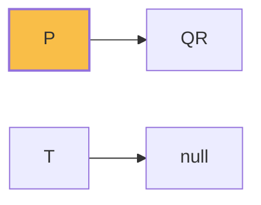

**Relational Database Design**
=====================================

### Introduction
---------------

Relational database design involves creating a well-structured and optimized database schema to efficiently store and retrieve data. It's based on the relational model, which views data as a collection of relations or tables with rows and columns.

### Core Concepts
-----------------

#### 1. Relations
--------------

A relation is a table with rows (tuples) and columns (attributes). Each row represents an instance of an entity, and each column represents an attribute of that entity.

#### 2. Functional Dependencies
-----------------------------

Functional dependencies are rules that describe how attributes in one relation depend on others. For example:

`P → QR` means that `Q` and `R` can be determined if `P` is known.

#### 3. Normalization
------------------

Normalization is the process of organizing data to minimize data redundancy and improve data integrity. There are different normal forms (1NF, 2NF, 3NF), each with its own set of rules for decomposing relations into smaller ones.

### Key Formulas/Theorems
-------------------------

*   The **First Normal Form** (1NF) states that a relation must have only one value in each cell and each column must contain values from the same domain.
*   The **Second Normal Form** (2NF) states that a relation must be in 1NF, and non-prime attributes of a relation should depend on the entire primary key, not just part of it.

### Problem Solving Patterns
---------------------------

#### Inference

To infer a new functional dependency from existing ones:

*   Look for dependencies involving composite keys.
*   Identify transitive relationships between attributes.

Example (GATE 2021-N-48):
Given `P → QR` and `T →`, we can infer that `PS T` is not directly related to the question. However, since `QR` is dependent on `P`, it implies that `R` may be dependent on `S`. Hence, functional dependency `(D) PS T` is not correct.



### Examples with Solutions
---------------------------

1.  **Example 1**

    Given:
    
    | A | B |
    |:---|:---|
    | 1 | 4 |
    | 2 | 5 |

    Determine the primary key and candidate keys.

    Solution:

    *   Primary Key (PK): `A` is the PK because it uniquely identifies each row.
    *   Candidate Keys: Both `A` and `B` are candidate keys, but we only need one.

```mermaid
graph LR
    A[P] -->|Primary Key|> B[Candidate Key]
    C[K1] -->|Candidate Key|> D[K2]
```

2.  **Example 2**

    Given:
    
    `R(A, B, C)`, with FDs: `A → BC` and `C → AB`

    Determine the closure of attribute set `{ A }`.

    Solution:

    *   Closure is obtained by applying FDs repeatedly until no new attributes can be added.
    *   `closure({ A }) = { A, B, C }`, because we can determine `B` and `C` from `A`.

```mermaid
graph LR
    A -->|FD: A → BC|> B[Added]
    C -->|FD: C → AB|> D[No new attributes added]
```

### Common Pitfalls
-------------------

1.  **Misunderstanding Normalization**

    *   Failing to apply the rules of normalization correctly.
2.  **Incorrect Inference**

    *   Misinterpreting transitive relationships between attributes.

### Quick Summary
-----------------

*   Relations: tables with rows and columns, where each row represents an instance of an entity.
*   Functional Dependencies: describe how attributes depend on others.
*   Normalization: organizing data to minimize redundancy and improve integrity.
*   Key Formulas/Theorems:
    *   1NF: one value in each cell, same domain for all columns
    *   2NF: non-prime attributes dependent on entire primary key

This comprehensive theory note covers all the essential concepts of relational database design, including relations, functional dependencies, normalization, and problem-solving patterns. It's designed to help students prepare for GATE CS exam questions and similar ones in the future.