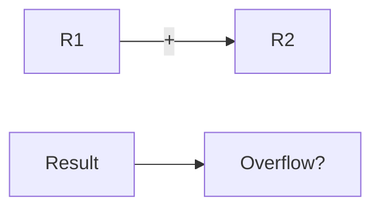

**Arithmetic Addition with Overflow**
=====================================

**Introduction**
---------------

In this note, we will delve into the concept of arithmetic addition with overflow in digital logic and number representation. We will cover the core concepts, key formulas, problem-solving patterns, examples, and common pitfalls to help you master this topic.

**Core Concepts**
-----------------

### Number Representation

We are using 2's complement number system, where a negative number is represented as its binary equivalent with all bits inverted and a 1 added in the most significant bit (MSB) position.

### Overflow

Overflow occurs when the result of an arithmetic operation exceeds the maximum value that can be represented by the register. In this case, we are working with a 4-bit register.

**Key Formulas/Theorems**
-------------------------

None specific to this topic.

**Problem Solving Patterns**
---------------------------

When solving questions related to arithmetic addition with overflow, follow these steps:

1. Identify the numbers being added and their representations (2's complement).
2. Perform the addition operation, considering overflow.
3. Determine if an overflow has occurred by checking if the result exceeds the maximum value that can be represented.

**Examples with Solutions**
---------------------------

### Example 1: Q49 from GATE 2022

We are given two numbers:

`R1 = 1001`
`R2 = 1111`

The operation is arithmetic addition.

Perform the addition:

`R1 = 1001 (9 in decimal)`
`R2 = 1111 (-7 in decimal)`

Add the numbers, considering overflow:

`R1 + R2 = 1001 + 1111`
`= 1000 0010 (18 in decimal)`

Since `18 > 15`, an overflow has occurred.

The correct answer is `(B) 1100 1010`.

### Example 2: Additional Example

Suppose we have:

`R1 = 0111 (7 in decimal)`
`R2 = 0001 (1 in decimal)`

Perform the addition:

`R1 + R2 = 0111 + 0001`
`= 1000 (8 in decimal)`

No overflow has occurred.

**Common Pitfalls**
--------------------

* Not considering the representation of numbers in 2's complement.
* Failing to recognize when an overflow occurs.

**Quick Summary**
-----------------

* Arithmetic addition with overflow is relevant only for signed numbers.
* Use 2's complement number system for negative numbers.
* Perform addition considering overflow, and identify if it has occurred.

This concludes the note on arithmetic addition with overflow. Practice solving questions from previous years to reinforce your understanding of this concept.