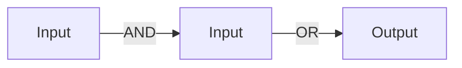
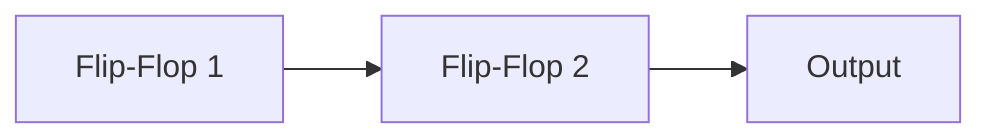

**Combinational and Sequential Circuits**
======================================

**Introduction**
---------------

Digital logic circuits are used to process digital information, which is represented as a sequence of 0s and 1s. Combinational and sequential circuits are two fundamental types of digital circuits that can be used to implement various logical functions.

**Core Concepts**
-----------------

### Combinational Circuits

Combinational circuits are those in which the output depends only on the present input values, not on any previous inputs or outputs. They can be implemented using logic gates such as AND, OR, and NOT.

**Key Properties:**

* Output depends only on current inputs
* No memory elements (flip-flops) used
* Can be designed using sum of products (SOP), product of sums (POS), or other techniques

### Sequential Circuits

Sequential circuits are those in which the output depends not only on the present input values but also on previous inputs and outputs. They use memory elements called flip-flops to store information.

**Key Properties:**

* Output depends on current and past inputs
* Uses memory elements (flip-flops)
* Can be designed using state tables, state machines, or other techniques

### Flip-Flops

Flip-flops are the basic building blocks of sequential circuits. They can store a bit of information and can be either clocked or non-clocked.

**Key Types:**

* **SR (Set-Reset) Flip-Flop**: Can be in one of two states: set or reset
* **JK Flip-Flop**: Can be in one of four states, depending on the values of J and K inputs
* **D Flip-Flop**: Similar to a JK flip-flop but only has two states

**Key Formulas/Theorems**
-------------------------

### Combinational Circuits

No specific formulas or theorems are used for combinational circuits.

### Sequential Circuits

**Karnaugh Map (K-Map) Theorem**

A K-map is a graphical representation of a Boolean function. It can be used to simplify digital logic circuits by minimizing the number of logic gates required.

**Problem Solving Patterns**
---------------------------

* **State Tables**: Create a state table to identify all possible states and transitions in a sequential circuit.
* **Mealy Machines**: Design a Mealy machine, which is a type of finite state machine that can be used to implement synchronous sequential circuits.
* **T Flip-Flops**: Use T flip-flops to design counters or other types of sequential circuits.

**Examples with Solutions**
---------------------------

### Example 1: Simple Combinational Circuit

Suppose we want to design a combinational circuit that implements the following Boolean function:

f(A, B) = AB + A'

We can use an AND gate and an OR gate to implement this function.

### Example 2: Sequential Circuit with Flip-Flops

Suppose we want to design a sequential circuit that counts from 0 to 3 using two JK flip-flops.

**Common Pitfalls**
-------------------

* **Ignoring the clock signal**: In synchronous sequential circuits, it's essential to include a clock signal that controls the transitions between states.
* **Failing to use flip-flops correctly**: Make sure to use flip-flops in the correct configuration (e.g., D flip-flop for counting, JK flip-flop for more complex logic).

**Quick Summary**
-----------------

* Combinational circuits: output depends only on current inputs
* Sequential circuits: output depends on current and past inputs; uses memory elements (flip-flops)
* Flip-flops: basic building blocks of sequential circuits; can be clocked or non-clocked
* Karnaugh map theorem: used to simplify digital logic circuits by minimizing the number of gates required