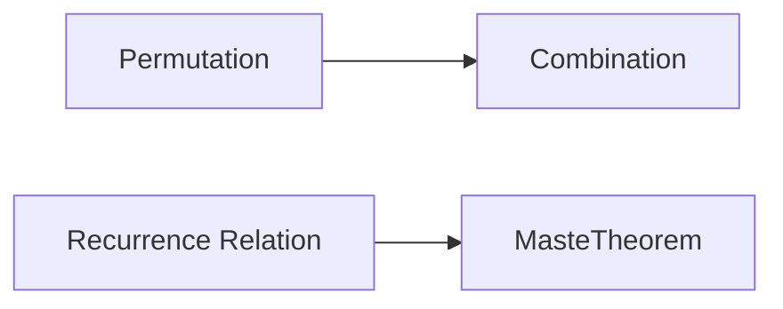

**Combinatorics**
================

### Introduction

Combinatorics is a branch of mathematics that deals with counting and arranging objects in various ways. It has numerous applications in computer science, particularly in algorithm design, data structures, and coding theory.

### Core Concepts

#### Permutations and Combinations

*   **Permutation**: An arrangement of objects in a specific order.
    *   Formula: $P(n, k) = \frac{n!}{(n-k)!}$
    *   Example: How many ways can you arrange 3 books on a shelf?
        *   $\Rightarrow P(5, 3) = \frac{5!}{(5-3)!} = \frac{120}{2} = 60$
*   **Combination**: A selection of objects without regard to order.
    *   Formula: $C(n, k) = \frac{n!}{k!(n-k)!}$
    *   Example: How many ways can you choose a team of 3 from 5 players?
        *   $\Rightarrow C(5, 3) = \frac{5!}{3!(5-3)!} = \frac{120}{6} = 20$

#### Recurrence Relations

*   **Recurrence Relation**: A relation that defines a sequence recursively.
    *   Example: The Fibonacci sequence is defined by $F_n = F_{n-1} + F_{n-2}$ for $n > 1$.

### Key Formulas/Theorems

*   **Master Theorem**:
    \[ T(n) = \begin{cases}
        O(n^d), & \text{if } f(n) = \Omega(n^d \log^{(k)} n) \text{ for some } k, \\
        \Theta(n^{\log_b a}), & \text{otherwise}.
    \end{cases} \]
*   **Pigeonhole Principle**: If $n$ items are put into $m$ containers, with $n > m$, then at least one container must contain more than one item.

### Problem Solving Patterns

#### Pattern 1: Counting and Arranging Objects

*   Use the permutation or combination formula to count the number of ways objects can be arranged.
*   Consider using a recurrence relation to solve problems involving sequences.

#### Example Solution:

Suppose we want to find the number of ways to choose 3 subsets from 5 elements. We can use combinations:
\[ C(5, 3) = \frac{5!}{3!(5-3)!} = \frac{120}{6} = 20 \]

### Common Pitfalls

*   Be careful when applying the Master Theorem; make sure to identify the correct case.
*   Don't confuse permutation and combination formulas.

### Quick Summary

*   Permutations: count arrangements of objects in specific order
    *   Formula: $P(n, k) = \frac{n!}{(n-k)!}$
*   Combinations: count selection of objects without regard to order
    *   Formula: $C(n, k) = \frac{n!}{k!(n-k)!}$
*   Recurrence Relations: define sequences recursively
*   Master Theorem: solve recurrence relations
*   Pigeonhole Principle: apply when putting items into containers

### Mermaid Diagrams

**Note**: This is a basic structure for your theory note. You can expand on each topic, add more examples and exercises, and include visualizations where applicable.

Remember to keep your content concise, accurate, and exam-focused.

Feel free to modify this template as you see fit to suit your needs!

---

If you would like me to update or expand anything in the above theory note, please let me know!