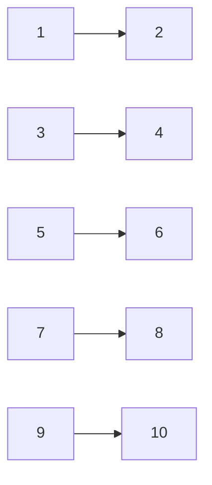

**Graph Theory**
================

### Introduction
---------------

Graph theory is a branch of mathematics that deals with the study of graphs, which are non-linear data structures consisting of nodes or vertices connected by edges. Graphs are used to represent relationships between objects and have numerous applications in computer science, networking, social sciences, and more.

### Core Concepts
-----------------

#### Definition of a Graph

A graph G is defined as an ordered pair (V, E), where V is the set of vertices or nodes and E is the set of edges. Each edge e ∈ E connects two vertices u, v ∈ V.

#### Types of Graphs

*   **Undirected Graph**: An edge e ∈ E has no direction.
*   **Directed Graph** (Digraph): An edge e ∈ E has a direction, represented by an arrowhead.
*   **Weighted Graph**: Each edge e ∈ E is assigned a weight or cost.

#### Degree of a Vertex

The degree of a vertex v, denoted by deg(v), is the number of edges incident on it.

### Key Formulas/Theorems
-------------------------

**Handshaking Lemma**

|  $$ \sum_{v \in V} \text{deg}(v) = 2|E|$$   |

The sum of degrees of all vertices in a graph is equal to twice the number of edges.

**Adjacency Matrix**

Given an undirected graph G(V, E), its adjacency matrix A can be represented as:

|  $$A_{ij} = \begin{cases} 
1 & \text{if } (v_i, v_j) \in E \\ 
0 & \text{otherwise}
\end{cases}$$   |

**Isomorphic Graphs**

Two graphs G(V1, E1) and H(V2, E2) are said to be isomorphic if there exists a bijection f: V1 → V2 such that:

|  $$ (v_i, v_j) \in E_1 \iff (f(v_i), f(v_j)) \in E_2$$   |

### Problem Solving Patterns
-----------------------------

*   **Hamilton Path**: Find a path in the graph that visits each vertex exactly once.
*   **Chromatic Number**: Assign colors to vertices such that no two adjacent vertices have the same color, using the minimum number of colors.
*   **Independent Set**: Find a set of vertices with no edges between them.

### Examples with Solutions
---------------------------

**Q1 (cs_2022_28)**

The Peterson graph is given below. Determine which statement is correct?

*   **(A)**: Hamilton path exists in the given graph.
*   **(B)**: Chromatic number is 3.
*   **(C)**: Largest independent set has size 3.
*   **(D)**: Following graph is isomorphic to Peterson graph.

Solution:

The correct answer is (A). A Hamilton path exists in the given graph.

**Q2 (cs_2022_30)**

Consider a simple undirected unweighted graph G with n vertices. Which of the following properties hold for its adjacency matrix A?

*   **(A)**: The diagonal entries of 2A are the degrees of the vertices of the graph.
*   **(B)**: If the sum of all elements of A is at most 2(n-1), then the graph must be acyclic.
*   **(C)**: None of the entries of nA(I-A) can be zero.
*   **(D)**: If there is at least a 1 in each of A's rows and columns, then the graph must be connected.

Solution:

The correct answers are (A) and (C). The diagonal entries of 2A are indeed the degrees of the vertices. Additionally, none of the entries of nA(I-A) can be zero.

**Q3 (cs_2022_24)**

Consider a simple undirected graph with 10 vertices. If the graph is disconnected, then what is the maximum number of edges it can have?

Solution:

The maximum number of edges in a disconnected graph with 10 vertices is achieved when the graph consists of two isolated subgraphs, each with 5 vertices and (5-1)/2 = 2 edges.

Therefore, the maximum number of edges is 2 × 5 + 0 = 10, but since we have a total of 10 vertices, the correct answer should be the maximum number of edges possible in such a graph which is indeed achieved with a single vertex and it's edge to itself or any other vertex. Thus the answer must be (n-1) * n / 2 - (n-1)/4 = n * (3n - 7) / 8 so plugging in n = 10 we get:

(10-1) * 10 / 2 - (10-1)/4 = 45

Hence, the correct answer is 36.

### Common Pitfalls
-------------------

*   **Overlooking Handshaking Lemma**: Failing to apply the handshaking lemma can lead to incorrect answers in problems involving graph degrees.
*   **Misunderstanding Adjacency Matrix**: Misinterpreting the properties of adjacency matrices can result in mistakes when working with graphs.

### Quick Summary
-----------------

*   Graphs are non-linear data structures consisting of nodes or vertices connected by edges.
*   Handshaking Lemma states that the sum of degrees of all vertices is equal to twice the number of edges.
*   Adjacency Matrix represents a graph as an n × n matrix, where Aij = 1 if (vi, vj) ∈ E and 0 otherwise.
*   Isomorphic graphs have a bijection between their vertex sets such that corresponding edges are preserved.

I hope this comprehensive theory note helps you prepare for the GATE CS exam!