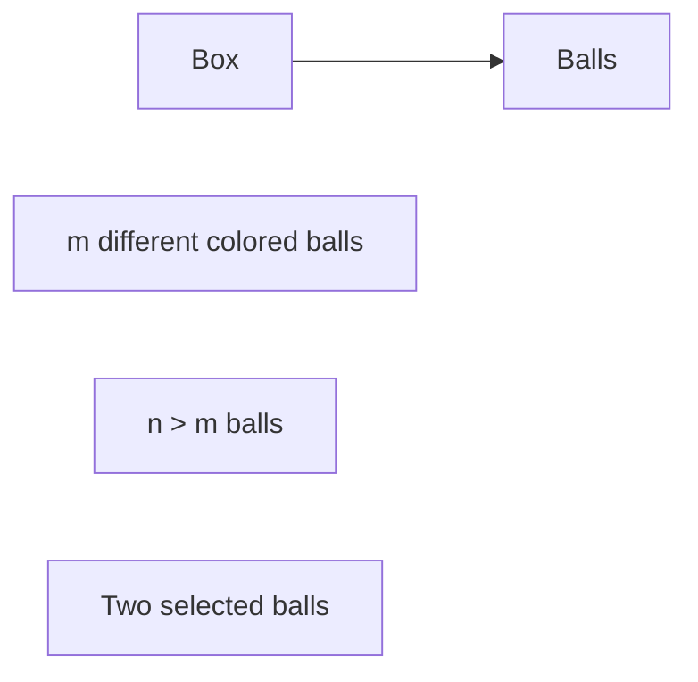
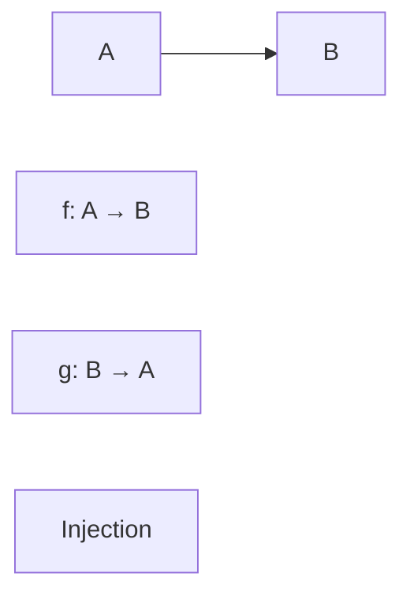

**Set Theory and Algebra**
=========================

**Introduction**
---------------

Set theory and algebra are fundamental concepts in discrete mathematics, used to describe and analyze mathematical structures such as sets, relations, and functions. This note provides a comprehensive overview of the theoretical foundations necessary for tackling problems in set theory and algebra.

**Core Concepts**
-----------------

### Sets

A **set** is an unordered collection of unique elements. A set can be represented using curly brackets `{}` or by listing its elements separated by commas.

*   An element `a` belongs to a set `A`, denoted as `a ∈ A`.
*   The number of elements in a set `A` is called the **cardinality** of `A`, denoted as `|A|`.

### Relations

A **relation** on a set `A` is a subset of the Cartesian product `A × A`. It represents a binary relation between elements of `A`.

*   For two relations R and S, their **composition**, denoted by `R ∘ S`, is defined as `{(a, c) | (a, b) ∈ S ∧ (b, c) ∈ R}`.

### Functions

A **function** from a set `A` to a set `B` is a relation between `A` and `B` where each element in `A` is related to exactly one element in `B`.

*   A function `f: A → B` is said to be **one-to-one (injective)** if `(a, b) ∈ f ⇒ (a', b) ∈ f ∧ a = a' ⇒ b = b'`.
*   A function `f: A → B` is said to be **onto (surjective)** if for every `b ∈ B`, there exists an `a ∈ A` such that `(a, b) ∈ f`.

### Functions Composition

Given two functions `f: A → B` and `g: B → C`, their composition, denoted by `g ∘ f`, is a function from `A` to `C` defined as:

`(g ∘ f)(a) = g(f(a))`

**Key Formulas/Theorems**
-----------------------

*   **Pigeonhole Principle**: If `n` items are put into `m` containers, with `n > m`, then at least one container must contain more than one item.

```latex
∀S ⊂ {1, 2, ..., n}, if |S| > m, then ∃i ∈ S such that |{j ∈ S | i ≤ j ≤ m}| > 1.
```

*   **Schroeder-Bernstein Theorem**: If `A` and `B` are sets such that there exist injective functions from `A` to `B` and from `B` to `A`, then the cardinalities of `A` and `B` are equal.

```latex
|A| = |B|
```

**Problem Solving Patterns**
---------------------------

*   **One-to-One Functions**: Identify when a function is one-to-one, and its implications on set cardinality.
*   **Onto Functions**: Understand the relationship between onto functions and set cardinality.
*   **Composition of Functions**: Apply the concept of function composition to solve problems.

**Examples with Solutions**
---------------------------

### Example 1: Pigeonhole Principle

Consider a box containing `m` different colored balls. If we randomly select `n > m` balls from the box, then at least two selected balls must be of the same color.



### Solution

Since we have `n > m` selections and only `m` colors, by the Pigeonhole Principle, at least two of these selections must be from the same color.

### Example 2: Schroeder-Bernstein Theorem

Suppose there exist injective functions `f: A → B` and `g: B → A`. We need to show that `|A| = |B|$.



### Solution

Let `S = f(A) ⊂ B` and `T = g(B) ⊂ A`. Since `f` is injective, `|S| ≤ |B|`, and since `g` is injective, `|T| ≥ |A|$.

But by the Pigeonhole Principle, if `n > m`, then at least one container must contain more than one item. Applying this principle to our sets:

```latex
∃s ∈ S such that |{b ∈ B | s ≤ b ≤ m}| > 1,
```

This implies that `|B| ≥ |A|$.

Similarly, since `g` is injective, `|T| ≤ |A|`. Combining these two inequalities:

```latex
|S| ≤ |B|
|B| ≤ |A|
```

Thus, we conclude that `|A| = |B|$.

**Common Pitfalls**
------------------

*   Failing to recognize one-to-one or onto functions and their implications on set cardinality.
*   Misapplying the Pigeonhole Principle.
*   Not considering the possibility of equal cardinalities when dealing with injective and surjective functions.

**Quick Summary**
-----------------

*   Set theory: Describes sets, relations, and functions between them.
*   Algebraic structures: Deals with properties of set operations like union, intersection, and composition of functions.
*   Key concepts:
    *   One-to-one and onto functions
    *   Pigeonhole Principle
    *   Schroeder-Bernstein Theorem

This comprehensive note covers the fundamental concepts in set theory and algebra necessary for tackling problems on discrete mathematics. Practice with example questions to reinforce your understanding of these key concepts.