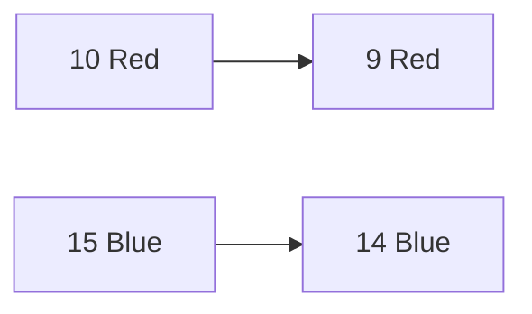

# Probability and Statistics
==========================

## Introduction
---------------

Probability and statistics are fundamental branches of mathematics used to describe and analyze random phenomena. In this note, we will focus on the core concepts, formulas, and techniques required to tackle probability-related questions in the GATE CS exam.

## Core Concepts
-----------------

### 1. Random Experiments and Sample Space

A **random experiment** is an action or situation that produces a result whose outcome is uncertain. The set of all possible outcomes is called the **sample space**, denoted by Ω (Omega).

### 2. Events and Probabilities

An **event** is any subset of the sample space. The probability of an event A, P(A), is defined as:

$$P(A) = \frac{\text{Number of favorable outcomes}}{\text{Total number of possible outcomes}}$$

### 3. Conditional Probability

The probability of an event A given that event B has occurred is denoted by P(A|B). It is calculated using the formula:

$$P(A|B) = \frac{P(A \cap B)}{P(B)}$$

### 4. Independence and Mutual Exclusivity

Two events A and B are said to be **independent** if:

$$P(A|B) = P(A)$$

If events A and B cannot occur simultaneously, they are called **mutually exclusive**.

## Key Formulas/Theorems
-------------------------

*   **Probability of Independent Events**: $P(A \cap B) = P(A) \cdot P(B)$
*   **Probability of Mutually Exclusive Events**: $P(A \cup B) = P(A) + P(B)$
*   **Bayes' Theorem**:

$$P(A|B) = \frac{P(B|A) \cdot P(A)}{P(B)}$$

## Problem Solving Patterns
---------------------------

### 1. Tree Diagrams

Visualize the sample space and events using tree diagrams to identify dependencies and conditional probabilities.

### 2. Independence Checking

Check if events are independent before calculating conditional probabilities.

### 3. Total Number of Outcomes Calculation

Calculate the total number of possible outcomes in a probability question, considering replacement or without replacement scenarios.

## Examples with Solutions
---------------------------

### Example 1:

Q: A bag contains 10 red balls and 15 blue balls. Two balls are drawn randomly without replacement. Given that the first ball drawn is red, the probability (rounded off to 3 decimal places) that both balls drawn are red is ___________.

Solution:

Let's use a tree diagram to visualize the sample space:

Since we know the first ball drawn is red, we can directly calculate the probability of drawing a second red ball:

$$P(Red Ball in 2^{nd} drawn) = \frac{9}{24} = \frac{3}{8}$$

Hence, the answer is **0.375**.

### Example 2:

Q: Given that event A has occurred, what is the probability that event B will occur?

Solution:

Using Bayes' Theorem:

$$P(B|A) = \frac{P(A|B) \cdot P(B)}{P(A)}$$

## Common Pitfalls
------------------

*   Confusing independent and mutually exclusive events.
*   Not accounting for replacement or without replacement scenarios in probability calculations.
*   Failing to identify the sample space and its subsets.

## Quick Summary
---------------

*   Define random experiments, sample space, and events.
*   Calculate probabilities using formulas (e.g., P(A), P(A|B)).
*   Identify independence and mutual exclusivity of events.
*   Apply Bayes' Theorem for conditional probability calculations.
*   Visualize the problem space using tree diagrams.

By mastering these concepts and techniques, you'll be well-prepared to tackle probability-related questions in the GATE CS exam.