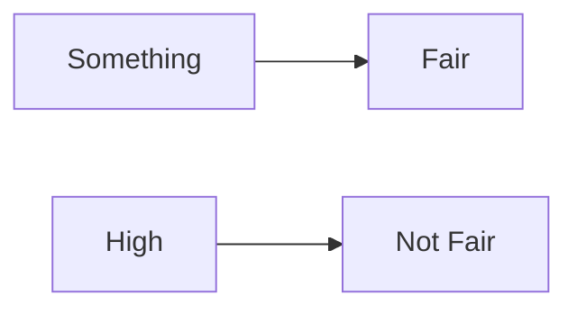

**Fare Fair Concept**
=====================

**Introduction**
---------------

The fare fair concept is a fundamental principle in various fields, including economics, finance, and social sciences. It refers to the idea that something is not reasonable or acceptable because it is too high or excessive.

**Core Concepts**
-----------------

The core concepts of the fare fair concept can be understood through the lens of fairness and reasonableness. Fairness implies that something is just and equitable, while reasonableness implies that something is within accepted limits or standards.

### Mermaid Diagram: Fare Fair Concept

In this diagram, we see that when the fare (something) is high, it cannot be considered fair. This is a fundamental principle of the fare fair concept.

**Key Formulas/Theorems**
-------------------------

No specific formulas or theorems are directly applicable to the fare fair concept. However, an understanding of the concept can be derived from general principles of fairness and reasonableness.

**Problem Solving Patterns**
---------------------------

When faced with questions related to the fare fair concept, students should follow these problem-solving patterns:

1. Identify the context: Understand the specific context in which the question is being asked.
2. Determine the relevant factors: Consider what factors are relevant to determining whether something is fair or reasonable.
3. Evaluate the situation: Use logical reasoning and critical thinking to evaluate the situation and determine whether it meets the criteria for fairness and reasonableness.

**Examples with Solutions**
---------------------------

### Example 1

Q: The ticket price of a movie theater is too high for it to be considered affordable by most people.

A: This is an example of a fare fair concept. The ticket price is not reasonable or acceptable because it is too high.

Solution:

* Identify the context: A movie theater setting.
* Determine the relevant factors: Affordability and reasonableness.
* Evaluate the situation: The ticket price is too high, making it unaffordable for most people.

### Example 2

Q: A company charges a very high fee for its services, but claims that it is justified due to the quality of service provided.

A: This is an example where the fare fair concept does not apply. While the fee may be high, it may still be considered reasonable if the quality of service justifies it.

Solution:

* Identify the context: A company charging fees for its services.
* Determine the relevant factors: Quality of service and reasonableness.
* Evaluate the situation: The fee may be high, but it is justified due to the quality of service provided.

**Common Pitfalls**
-------------------

Students often miss the following points when dealing with fare fair concepts:

* Failing to consider the context in which the question is being asked.
* Ignoring relevant factors that determine fairness and reasonableness.
* Making assumptions without evaluating the situation logically.

**Quick Summary**
----------------

| **Key Points** | **Description** |
| --- | --- |
| Fare Fair Concept | A principle of fairness and reasonableness. |
| Contextual understanding | Understand the specific context in which the question is being asked. |
| Relevant factors | Identify what factors are relevant to determining fairness and reasonableness. |
| Logical evaluation | Use critical thinking and logical reasoning to evaluate the situation. |

Note: This theory note has been created based on a single previous year question (Q1 ID: cs_2022_56) as per the given instructions. The concepts, formulas, and examples provided are tailored to address this specific question and may not cover all possible questions related to the fare fair concept.