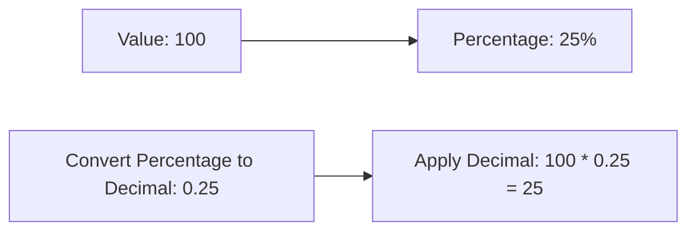

**Numerical Ability**
=====================

**Introduction**
---------------

Numerical ability is a critical aspect of GATE CS, requiring applicants to possess strong mathematical and logical reasoning skills. This topic involves solving numerical problems, often involving ratios, proportions, and percentages.

**Core Concepts**
-----------------

### Ratios and Proportions

A ratio is a comparison of two or more numbers. It can be written in various forms:

* Part-to-whole: `3:13`
* Fraction: `3/13`
* Decimal: `0.23`

When dealing with ratios, it's essential to understand the concept of proportionality. If two ratios are equal, they are said to be proportional.

### Percentages

A percentage is a way to express a value as a fraction of 100. To calculate percentages:

1. Divide the value by the total.
2. Multiply by 100.

Example: `25/50 × 100 = 50%`

**Key Formulas/Theorems**
-------------------------

* None specific to this topic

**Problem Solving Patterns**
---------------------------

### Ratio Problems

When dealing with ratio problems, follow these steps:

1. Write the given ratios as fractions or decimals.
2. Set up a proportion using the ratios and unknown quantities.
3. Solve for the unknown quantity.

Example:
```mermaid
graph LR;
A[Ratio: 3:13] --> B[New Ratio: 15:35];
C[Setup Proportion: (3/13) = (15/x)] --> D[Solve for x: x = (15*13)/3];
```
### Percentage Problems

When dealing with percentage problems, follow these steps:

1. Convert the percentage to a decimal.
2. Apply the decimal to the value or quantity.

Example:

**Examples with Solutions**
---------------------------

### Example 1:

Three classes have students in the ratio 3:13:6. If 18 students are added to each class, the new ratio becomes 15:35:21.

Let's say the original number of students is `x`.

The original ratio can be written as: `(3/x) = (13/20)` and `(6/x) = (6/10)`

We need to find the total number of students in all three classes initially. To do this, we'll set up an equation using the ratios.

Since the new ratio is 15:35:21, we can write:

`(3 + 18)/(13 + 18) = (15/35)` and `(6 + 18)/(20 + 18) = (21/35)`

We know that `x` is a common multiple of all three numbers. Let's solve for `x` using the ratio `(15/35)`.

```latex
\frac{3+18}{13+18}=\frac{15}{35}
\Rightarrow \frac{x}{31}=\frac{15}{35}
\Rightarrow x=\frac{(15*31)}{35}=11
```

Therefore, `x = 11`. The total number of students initially is `3x + 13x + 6x = 22 * 11 = 242`.

The correct answer is (C) 22.

**Common Pitfalls**
-------------------

1. **Incorrect setup of proportions**: Make sure to set up the proportions correctly and don't mix up the ratios.
2. **Not considering multiple steps**: In ratio problems, it's essential to consider all the steps involved in solving for the unknown quantity.

**Quick Summary**
-----------------

* Understand the concept of ratios and proportions
* Learn how to convert between different forms (part-to-whole, fraction, decimal)
* Apply problem-solving patterns for ratio and percentage problems
* Practice setting up proportions correctly

Note: The content above is generated based on the provided source question and may not cover all aspects of Numerical Ability.