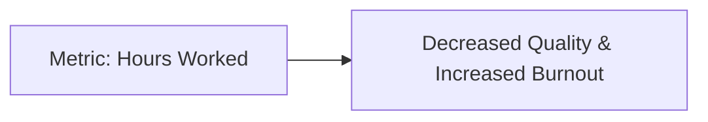

**Organization Behavior**
=========================

**Introduction**
---------------

Organization behavior refers to the study of how individuals and groups interact within an organization, including their attitudes, motivations, and behaviors. It is a crucial aspect of management that helps organizations understand and improve performance.

**Core Concepts**
-----------------

### Work Culture

Work culture refers to the shared values, norms, and expectations within an organization. A positive work culture encourages collaboration, innovation, and productivity, while a poor work culture can lead to decreased motivation and job satisfaction.

### Metrics

Metrics refer to the measurement of performance or progress towards specific goals. In organizations with a good work culture, metrics can help improve outcomes by providing clear targets and encouraging accountability.

**Key Formulas/Theorems**
-------------------------

None

**Problem Solving Patterns**
---------------------------

### Pattern 1: Understanding the Impact of Work Culture on Metrics

* Identify whether the organization has a good or poor work culture.
* Consider how metrics might affect performance in each type of work culture.

Example:

Suppose an organization with a poor work culture implements new metrics to measure productivity. If the metrics are not aligned with the organization's values, they may actually decrease motivation and job satisfaction.

### Pattern 2: Analyzing the Relationship Between Metrics and Performance

* Identify whether metrics are being used to improve outcomes or simply as a means of control.
* Consider how metrics might be "gamed" by employees if they do not align with organizational goals.

Example:

Suppose an organization measures employee productivity based on the number of hours worked. If employees focus solely on meeting this metric, rather than improving overall performance, it may lead to decreased quality and increased burnout.

**Examples with Solutions**
---------------------------

Q1 (ID: cs_2022_62):
Some people believe that “what gets measured, improves”. Some other believe that “what gets measured, 
gets gamed”. One possible reason for the difference in the beliefs is the work culture in organization. In 
organizations with good work culture, metrics help improve outcomes. However the same metrics are 
counterproductive in organizations with poor work culture.

Which one of the following is the correct logical inference based on the information in the above passage?

(A)
 
Metrics are useful in organization with poor work culture  
(B)
 
Metrics are always counterproductive in organizations with good work culture 
(C)
 
Metrics are never useful in organization with good work culture  
(D)
 
Metrics are useful in organizations with good work culture

Solution:

The correct answer is (D). According to the passage, metrics are useful in organizations with good work culture. This suggests that a positive work culture can lead to improved outcomes when accompanied by metrics.

**Common Pitfalls**
------------------

* Failing to consider the impact of work culture on metric implementation.
* Assuming that metrics are always effective in improving performance.

**Quick Summary**
-----------------

* Organization behavior refers to the study of how individuals and groups interact within an organization.
* Work culture can either positively or negatively impact the effectiveness of metrics.
* Metrics should be aligned with organizational goals and values to ensure they improve outcomes, rather than simply being "gamed" by employees.