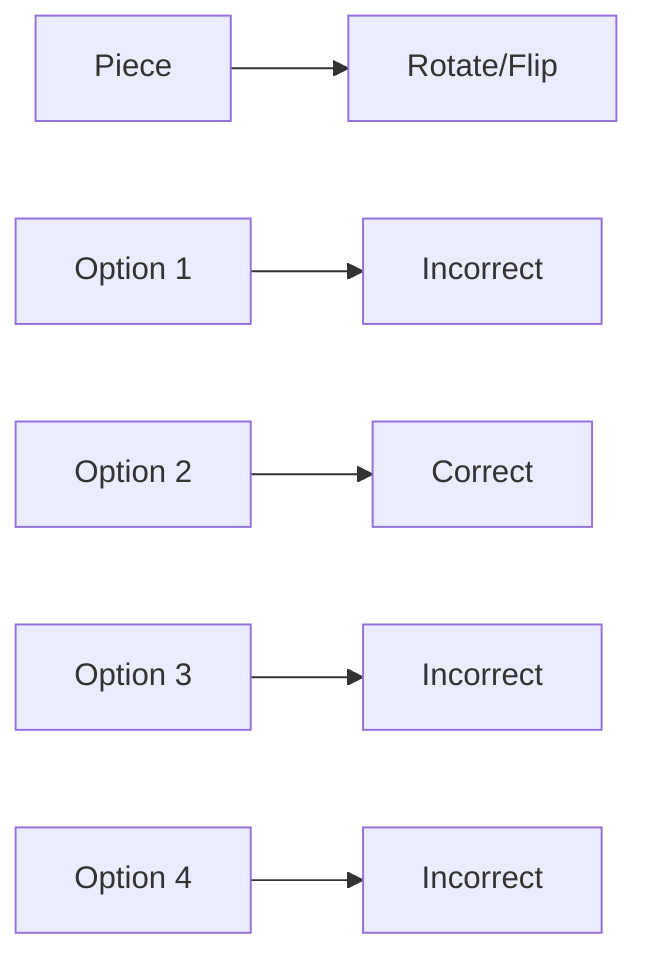

**Spatial Reasoning**
======================

**Introduction**
---------------

Spatial reasoning involves understanding and manipulating geometric shapes, patterns, and relationships to solve problems. It requires analyzing visual information, recognizing symmetries, and using logical deductions to arrive at a solution.

**Core Concepts**
-----------------

### 1. Symmetry and Geometric Shapes

*   **Line symmetry**: A figure has line symmetry if it looks the same when reflected across a line.
*   **Rotational symmetry**: A figure has rotational symmetry if it looks the same after rotation by a certain angle.
*   **Geometric shapes**: Familiarity with basic geometric shapes such as points, lines, angles, triangles, quadrilaterals, polygons, circles, and 3D objects.

### 2. Visualization and Pattern Recognition

*   **Visualizing transformations**: Understanding how shapes can be transformed through rotation, reflection, translation, and scaling.
*   **Recognizing patterns**: Identifying repeating or regular structures in geometric figures.

**Key Formulas/Theorems**
-------------------------

None specific to spatial reasoning are required for this topic. However, familiarity with basic geometric formulas like perimeter, area, and volume of common shapes is assumed.

**Problem Solving Patterns**
---------------------------

### 1. Analyzing Visual Information

*   **Break down complex figures**: Divide the figure into simpler components to identify symmetries or patterns.
*   **Identify key features**: Note any distinctive characteristics of the figure that can aid in solving the problem.

### 2. Logical Deductions

*   **Use logical reasoning**: Apply rules and properties of geometric shapes to deduce the solution.
*   **Eliminate impossible options**: If a particular option does not match the given information, eliminate it from consideration.

**Examples with Solutions**
---------------------------

### Example 1: Jigsaw Puzzle (Source Question cs_2021-N_8)

Given one piece of a jigsaw puzzle, determine which shape will complete the rectangle when assembled with the provided piece. The pieces can be rotated or flipped.



Solution:

*   Analyze the given piece and recognize that it has a specific shape and orientation.
*   Eliminate options that do not match this shape or orientation.
*   For Option B, rotate/flipping the given piece to align with one of the remaining options.
*   Identify which option forms a complete rectangle when assembled.

### Example 2: Pattern Completion

Complete the pattern by identifying the next geometric figure in the sequence:

```mermaid
sequenceDiagram
    participant A as Triangle
    participant B as Square
    participant C as Pentagon
    participant D as Hexagon
    Note over A,B,C,D: The pattern shows an increase of one side for each subsequent figure.
```

Solution:

*   Identify the relationship between each figure in the sequence (number of sides increases by 1).
*   Apply this relationship to determine the next figure in the pattern.

**Common Pitfalls**
-------------------

### Overcomplicating the problem

Avoid unnecessary analysis or overthinking. Focus on identifying key features and applying logical deductions.

### Not considering all possibilities

Ensure that you evaluate each option thoroughly, eliminating those that do not match the given information.

### Quick Summary
------------------

*   Familiarize yourself with basic geometric shapes and their properties.
*   Develop skills in visualizing transformations and recognizing patterns.
*   Apply logical reasoning to deduce solutions, eliminating impossible options when necessary.

This comprehensive theory note on spatial reasoning covers all theoretical concepts, formulas, and insights required to solve the source questions and similar future problems.