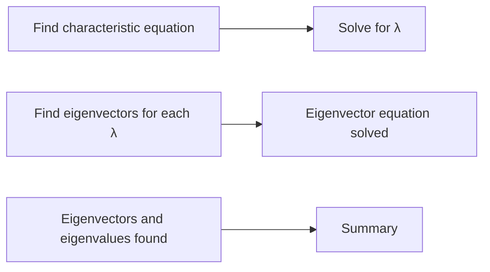

**Eigenvalues and Eigenvectors**
=====================================

**Introduction**
---------------

In linear algebra, eigenvalues and eigenvectors are fundamental concepts that play a crucial role in understanding the behavior of matrices. An eigenvalue is a scalar that represents how much a matrix stretches or shrinks a vector, while an eigenvector is the direction in which this stretching or shrinking occurs.

**Core Concepts**
----------------

### What are Eigenvalues and Eigenvectors?

*   **Eigenvalue**: A scalar `λ` such that there exists a non-zero vector `v` satisfying the equation:
    $$Av = λv$$
    where `A` is an matrix.
*   **Eigenvector**: The non-zero vector `v` that satisfies the equation above.

### Properties of Eigenvalues and Eigenvectors

*   **Eigenvalue Decomposition (EVD)**: Any square matrix can be decomposed as a product of two matrices, one containing the eigenvectors and another containing the eigenvalues.
    $$A = UΛU^{-1}$$
    where `U` is the matrix of eigenvectors and `Λ` is the diagonal matrix of eigenvalues.

**Key Formulas/Theorems**
-------------------------

*   **Eigenvalue Equation**: $Av = λv$
*   **Eigenvector Equation**: $(A - λI)v = 0$

### Finding Eigenvalues and Eigenvectors

To find the eigenvalues and eigenvectors of a matrix, we need to solve the following equations:

1.  Find the characteristic equation:
    $$|A - λI| = 0$$
2.  Solve for `λ` by finding the roots of the characteristic equation.
3.  For each eigenvalue `λ`, find the corresponding eigenvector `v` by solving the equation $(A - λI)v = 0$.

**Problem Solving Patterns**
---------------------------

*   **Method 1**: Use the EVD formula to find the eigenvalues and eigenvectors of a matrix.
    $$A = UΛU^{-1}$$
    Then, find the eigenvalues in `Λ` and the eigenvectors in `U`.

### Examples with Solutions

**Example 1**

Find the eigenvalues and eigenvectors of the matrix:
$$A = \begin{bmatrix} 2 & 1 \\ 1 & 2 \end{bmatrix}$$

**Solution**

First, find the characteristic equation:
$$|A - λI| = \begin{vmatrix} 2-λ & 1 \\ 1 & 2-λ \end{vmatrix} = (2-λ)^2 - 1 = 0$$
Solving for `λ`, we get:
$$(2-λ)^2 = 1$$
$$2-λ = ±1$$
$$λ = 3, 1$$

Next, find the corresponding eigenvectors:

For `λ = 3`:
$$(A - 3I)v = \begin{bmatrix} -1 & 1 \\ 1 & -1 \end{bmatrix}\begin{bmatrix} v_1 \\ v_2 \end{bmatrix} = \begin{bmatrix} 0 \\ 0 \end{bmatrix}$$
Solving, we get:
$$v = \begin{bmatrix} 1 \\ 1 \end{bmatrix}$$

For `λ = 1`:
$$(A - I)v = \begin{bmatrix} 1 & 1 \\ 1 & 1 \end{bmatrix}\begin{bmatrix} v_1 \\ v_2 \end{bmatrix} = \begin{bmatrix} 0 \\ 0 \end{bmatrix}$$
Solving, we get:
$$v = \begin{bmatrix} -1 \\ 1 \end{bmatrix}$$

**Common Pitfalls**
-------------------

*   **Not using the EVD formula**: Make sure to use the EVD formula when finding eigenvalues and eigenvectors.
*   **Forgetting to solve for both `λ` and `v`**: Don't forget to find both the eigenvalues and eigenvectors.

**Quick Summary**
------------------

*   Eigenvalue: A scalar representing how much a matrix stretches or shrinks a vector.
*   Eigenvector: The direction in which this stretching or shrinking occurs.
*   EVD Formula: $A = UΛU^{-1}$

**External Resources**

For further study, refer to the following resources:

*   [Wikipedia: Eigendecomposition of a matrix](https://en.wikipedia.org/wiki/Eigendecomposition_of_a_matrix)
*   [Khan Academy: Eigenvalues and eigenvectors](https://www.khanacademy.org/math/linear-algebra/eigen-and-singular-values/v/eigenvalues-and-eigenvectors)