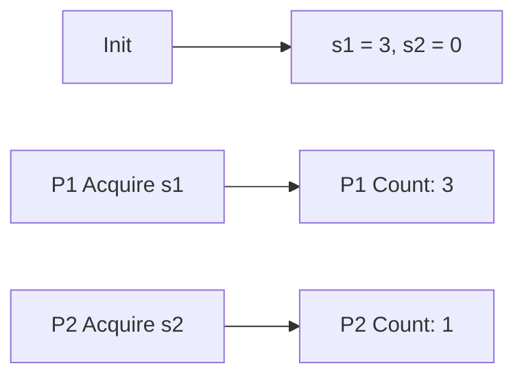
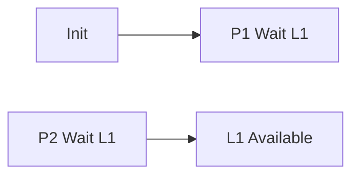

**Concurrency and Synchronization**
=====================================

**Introduction**
---------------

Concurrency and synchronization are fundamental concepts in Operating Systems that enable multiple processes or threads to share resources efficiently while ensuring correctness and avoiding deadlocks. This topic covers the principles, algorithms, and techniques for managing concurrent access to shared resources.

**Core Concepts**
-----------------

### 1. Mutual Exclusion

Mutual exclusion ensures that only one process or thread can access a shared resource at a time. It prevents multiple processes from accessing the same resource simultaneously, thus avoiding data corruption and ensuring consistency.

### 2. Synchronization

Synchronization is used to coordinate the actions of multiple threads or processes when accessing shared resources. It ensures that these actions are executed in a predictable order, preventing deadlocks and ensuring correct execution.

### 3. Semaphores

Semaphores are a synchronization mechanism that allow multiple processes to share access to a resource by managing the count of available slots. They can be initialized with a specific value and used as counters for concurrent access.

### 4. Locks

Locks, also known as mutexes (mutual exclusion), are synchronization mechanisms that prevent other threads from accessing a shared resource while one thread is holding it.

**Key Formulas/Theorems**
-------------------------

*   **Lamport's Bakery Algorithm**: A deadlock-free algorithm for mutual exclusion using semaphores.
    \[ f_{i}(t) = f_{i-1}(t+1), i=2,3,\ldots,n-1 \]
    where $f_i(t)$ is the value chosen by process $P_i$ at time $t$.

**Problem Solving Patterns**
---------------------------

### 1. Analyzing Deadlocks

To determine if a system will deadlock, look for cycles in resource allocation and necessary conditions:

*   **Necessary Conditions**: Mutual exclusion, Hold and Wait, No Preemption, and Circular Wait.
    A system will not deadlock if any of these conditions are absent.

### 2. Understanding Synchronization Algorithms

Synchronization algorithms ensure that multiple threads access shared resources correctly while minimizing the overhead of synchronization primitives.

**Examples with Solutions**
---------------------------

### 1. Example 1: Semaphores

Suppose we have two semaphores, $s_1$ and $s_2$, initialized to 3 and 0 respectively. Two processes, P1 and P2, share these semaphores. Initially, P1 acquires $s_1$ three times and P2 acquires $s_2$ once.

P1 acquires $s_1$ three times and P2 acquires $s_2$ once. If P1 tries to acquire $s_2$, it will be blocked until P2 releases $s_2$. Similarly, if P2 tries to acquire $s_1$, it will be blocked until P1 releases $s_1$.

### 2. Example 2: Locks

Consider two processes, P1 and P2, sharing a lock L1. Initially, both processes are waiting for the lock.

If P1 acquires the lock first, it will be able to execute its critical section. However, if P2 acquires the lock second, it may need to wait until P1 releases the lock.

**Common Pitfalls**
------------------

*   **Deadlocks**: Failing to prevent cycles in resource allocation.
*   **Livelocks**: Occurring when processes are waiting indefinitely for resources that cannot be allocated.
*   **Starvation**: When a process is unable to access a shared resource due to continuous allocation of the resource to other processes.

**Quick Summary**
-----------------

*   Mutual exclusion ensures single access to shared resources.
*   Synchronization coordinates actions of multiple threads or processes when accessing shared resources.
*   Semaphores and locks are synchronization mechanisms that prevent deadlocks.
*   Deadlock prevention involves analyzing necessary conditions for deadlock occurrence.

By mastering these concepts, you will be able to solve concurrency and synchronization problems efficiently. Practice with sample questions and analyze real-world scenarios to solidify your understanding of these fundamental principles in Operating Systems.