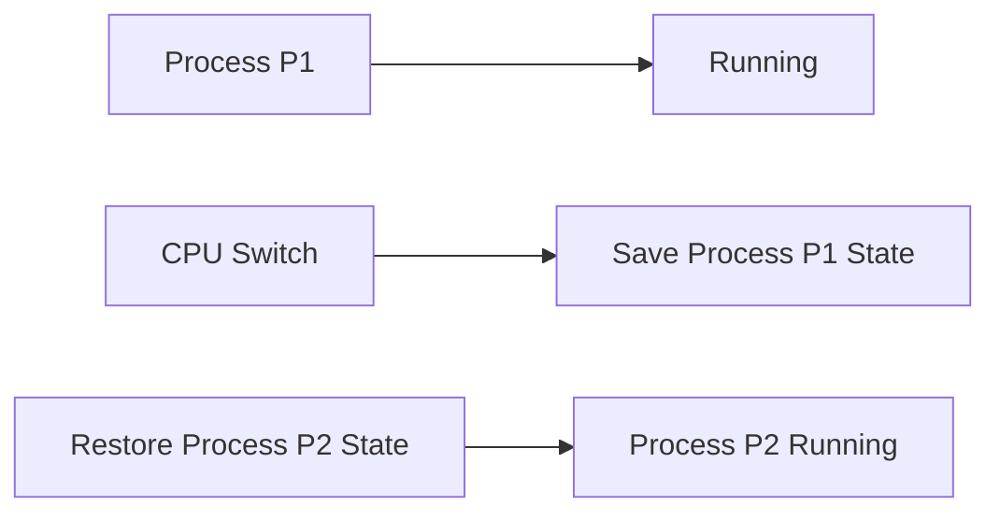

**Process Management**
=======================

### Introduction
Process management is a crucial aspect of operating systems that deals with the creation, execution, and termination of processes. It involves managing the process lifecycle, including process scheduling, synchronization, communication, and memory management.

### Core Concepts

#### Process States
A process can be in one of the following states:

*   **Running**: The process is currently executing on the CPU.
*   **Ready**: The process is waiting to be executed by the CPU.
*   **Blocked** (or **Waiting**): The process is waiting for an event, such as I/O completion or a resource release.
*   **Zombie** (or **Defunct**): The process has terminated but its parent process still exists.

#### Context Switching
Context switching occurs when the CPU switches from one process to another. This involves saving the current process's state and restoring the new process's state. Context switching can be expensive due to the overhead of switching between processes.

### Key Formulas/Theorems

None are directly relevant to this topic; however, knowledge of Big-O notation (e.g., O(1), O(n)) is essential for understanding process management concepts.

### Problem Solving Patterns

*   **Identify Process State Changes**: Determine when a process changes state (e.g., from running to ready or blocked).
*   **Understand Synchronization**: Analyze synchronization mechanisms, such as semaphores and monitors, that enable processes to communicate and coordinate with each other.
*   **Evaluate Process Scheduling Algorithms**: Compare different scheduling algorithms, like First-Come-First-Served (FCFS) and Priority Scheduling.

### Examples with Solutions

#### Example 1: Context Switching

Suppose we have two processes, `P1` and `P2`, running on a CPU. When the CPU switches from `P1` to `P2`, what happens?

*   **Step 1**: Save `P1's` state (registers, program counter, etc.) in memory.
*   **Step 2**: Restore `P2's` state from memory.
*   **Step 3**: Update the CPU registers and program counter with `P2's` values.

#### Example 2: Synchronization

Two processes, `P1` and `P2`, share a resource, `R`. `P1` needs to acquire `R` before accessing it. How can we implement synchronization using semaphores?

*   **Step 1**: Initialize the semaphore to 1 (available resources).
*   **Step 2**: `P1` attempts to acquire `R` by decrementing the semaphore.
*   **Step 3**: If the semaphore value is greater than 0, `P1` can access `R`.

### Common Pitfalls

*   Failing to consider process synchronization mechanisms when designing concurrent systems.
*   Overlooking the overhead of context switching in performance-critical applications.

### Quick Summary
*   Process states: running, ready, blocked, zombie.
*   Context switching involves saving and restoring process state.
*   Synchronization mechanisms enable processes to communicate and coordinate with each other.

**Context Switching Diagram**

Note: This is a simplified representation of context switching.