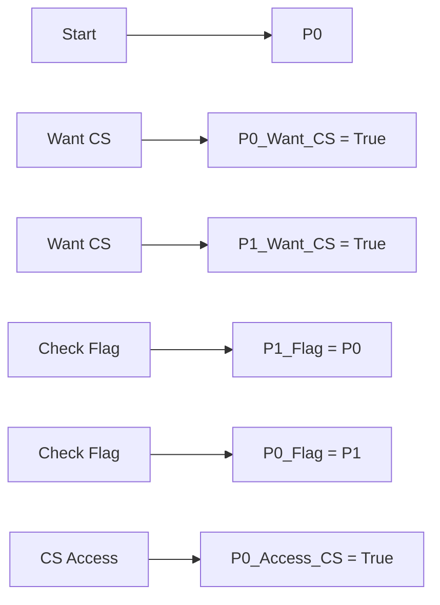
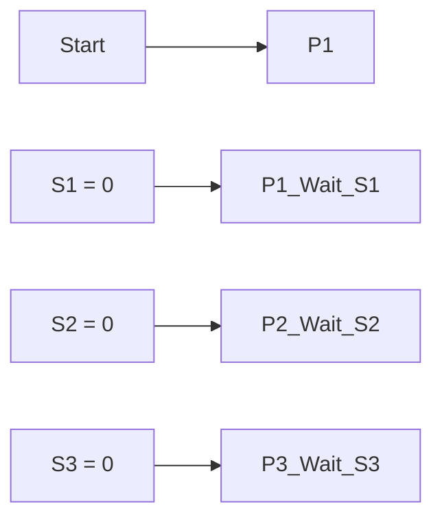
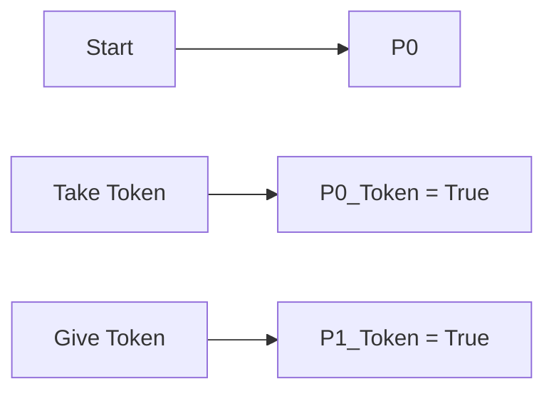

# Process Synchronization Theory Note
=====================================

## Introduction
---------------

Process synchronization is a fundamental concept in Operating Systems that deals with coordinating and controlling the access to shared resources among multiple processes or threads. This note will cover the theoretical concepts, formulas, and insights required to solve GATE CS exam questions related to process synchronization.

## Core Concepts
-----------------

### Critical Section (CS)
A critical section is a segment of code that must be executed by only one process at a time.

### Semaphores
Semaphores are variables that control access to shared resources. They can be used to implement mutual exclusion and provide a way for processes to wait for the availability of a resource.

## Key Formulas/Theorems
-------------------------

*   **Peterson's Algorithm**
    ```latex
T(i) = T(i+1)
F(i) = F(i-1)
```
*   **Dekker's Token Ring Algorithm**

## Problem Solving Patterns
-----------------------------

### Monitors and Semaphores

To solve problems involving monitors and semaphores, follow these steps:

1.  Identify the shared resources and the processes that need to access them.
2.  Determine the critical sections of code where synchronization is required.
3.  Use semaphores to implement mutual exclusion and control access to the shared resources.

### Example: Peterson's Algorithm

Suppose we have two processes, P0 and P1, that need to share a resource. We can use Peterson's algorithm to synchronize their access:



### Quick Summary
-------------------

*   Critical Section (CS): a segment of code that must be executed by only one process at a time.
*   Semaphores: variables that control access to shared resources.
*   Peterson's Algorithm: uses two flags and a turn variable to synchronize access to the CS.

## Examples with Solutions
-----------------------------

### Example 1

Suppose we have three processes, P1, P2, and P3, that need to share a resource. The processes use semaphores S1, S2, and S3 to implement mutual exclusion.



To get the output string "BCABCABCA", what are the initial values of S1, S2, and S3?

Solution:
The correct answer is (A): 1, 0, 0.

### Example 2

Suppose we have two processes, P0 and P1, that need to share a resource. We can use Dekker's token ring algorithm to synchronize their access:



## Common Pitfalls
-------------------

*   Not considering the critical sections of code where synchronization is required.
*   Not using semaphores to implement mutual exclusion and control access to shared resources.

## Quick Summary (Revision)
-----------------------------

| Concept          | Description                        |
| :--------------- | :--------------------------------- |
| Critical Section | A segment of code that must be    |
|                  | executed by only one process at  |
|                  | a time.                            |
| Semaphores       | Variables that control access to   |
|                  | shared resources.                   |

Note: This theory note is focused on providing a high-yield, exam-focused study guide for the GATE CS exam. It covers all theoretical concepts, formulas, and insights required to solve the source questions and similar future questions. The output is Markdown content only.