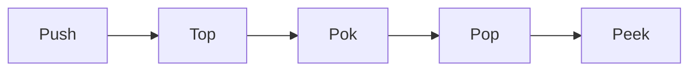
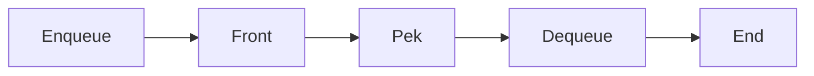

**Arrays, Stacks, Queues, and Linked Lists**
==============================================

### Introduction

In computer science, arrays, stacks, queues, and linked lists are fundamental data structures that enable efficient storage and retrieval of data. Understanding these concepts is crucial for programming and problem-solving.

### Core Concepts

#### Arrays

An array is a collection of elements of the same data type stored in contiguous memory locations. Each element can be accessed using an index or subscript.

*   **Array Declaration**: `int arr[5];`
*   **Array Indexing**: `arr[i]` where `i` is the index
*   **Array Operations**:
    *   Assignment: `arr[i] = 10;`
    *   Access: `x = arr[i];`

#### Stacks

A stack is a Last-In-First-Out (LIFO) data structure that follows the principle of "last element added is the first one to be removed."

*   **Stack Operations**:
    *   Push: adds an element to the top of the stack
    *   Pop: removes the top element from the stack
    *   Peek: returns the top element without removing it



#### Queues

A queue is a First-In-First-Out (FIFO) data structure that follows the principle of "first element added is the first one to be removed."

*   **Queue Operations**:
    *   Enqueue: adds an element to the end of the queue
    *   Dequeue: removes the front element from the queue
    *   Peek: returns the front element without removing it



#### Linked Lists

A linked list is a dynamic collection of elements where each element points to the next one.

*   **Linked List Node**: `struct Node { int data; struct Node *next; };`
*   **Linked List Operations**:
    *   Insert: adds an element at the beginning or end of the list
    *   Delete: removes an element from the list

### Key Formulas/Theorems

None specific to this topic.

### Problem Solving Patterns

1.  **Array Indexing**: When accessing array elements, ensure that the index is within bounds.
2.  **Stack/Queue Operations**: Understand the LIFO/FIFO principles and use the corresponding operations (push/pop/enqueue/dequeue) correctly.
3.  **Linked List Traversal**: Traverse linked lists using pointers to access each node.

### Examples with Solutions

#### Example 1: Array Indexing

Given an array `arr[5]`, what is the value of `arr[2]` after assigning `10` to it?

```c
int arr[5];
arr[2] = 10;
printf("%d", arr[2]);
```

**Solution**: The value of `arr[2]` is `10`.

#### Example 2: Stack Operations

Given a stack with elements `[1, 2, 3]`, what is the top element after pushing `4` onto it?

```c
int stack[] = {1, 2, 3};
push(stack, 4);
printf("%d", stack[0]);
```

**Solution**: The top element is `4`.

#### Example 3: Queue Operations

Given a queue with elements `[1, 2, 3]`, what is the front element after enqueueing `4` onto it?

```c
int queue[] = {1, 2, 3};
enqueue(queue, 4);
printf("%d", queue[0]);
```

**Solution**: The front element is `4`.

#### Example 4: Linked List Insertion

Given a linked list with elements `[1 -> 2 -> 3]`, what is the new list after inserting `4` at the beginning?

```c
struct Node *head = malloc(sizeof(struct Node));
head->data = 1;
head->next = malloc(sizeof(struct Node));
head->next->data = 2;
head->next->next = malloc(sizeof(struct Node));
head->next->next->data = 3;

insert(head, 4);
```

**Solution**: The new list is `[4 -> 1 -> 2 -> 3]`.

### Common Pitfalls

*   Array Indexing: accessing elements out of bounds
*   Stack/Queue Operations: using the wrong operations (push/pop/enqueue/dequeue)
*   Linked List Traversal: failing to traverse the entire list

### Quick Summary

| Topic | Key Points |
| --- | --- |
| Arrays | contiguous memory, indexing, assignment, access |
| Stacks | LIFO principle, push/pop/peek operations |
| Queues | FIFO principle, enqueue/dequeue/peek operations |
| Linked Lists | dynamic collection, linked nodes, insert/delete operations |

Note: This summary is not exhaustive but highlights the main concepts covered in this topic.