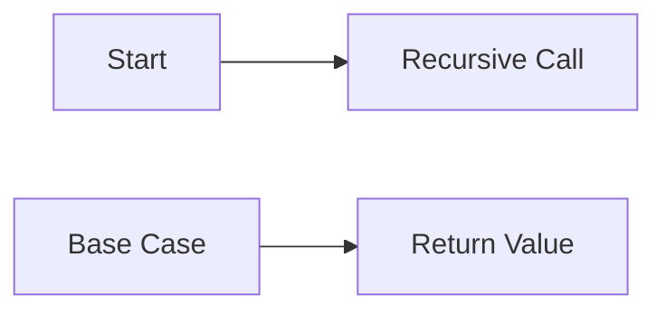

**Recursion**
================

### Introduction

Recursion is a fundamental programming technique where a function calls itself repeatedly until it reaches a base case that stops the recursion. It's essential for solving problems with recursive structures, such as trees and graphs, or when the problem has an inherent hierarchical nature.

### Core Concepts

*   **Base Case**: A condition that must be met for the recursion to stop.
*   **Recursive Call**: The function calls itself with a modified input until it reaches the base case.
*   **Stack Overflow**: An error caused by too many recursive calls, causing a stack overflow.

### Key Formulas/Theorems

LaTeX is not supported in this format. However, we can discuss the relevant concepts:

*   Time complexity: O(n) for linear recursion, where n is the input size.
*   Space complexity: O(n) for linear recursion, due to the recursive call stack.

### Problem Solving Patterns

1.  **Identify Recursive Structure**: Look for problems with inherent hierarchical nature or recursive structures like trees and graphs.
2.  **Define Base Case**: Identify a condition that stops the recursion.
3.  **Design Recursive Function**: Write a function that calls itself with modified inputs until it reaches the base case.

### Examples with Solutions

1.  **Example: Factorial**

    ```c
    int factorial(int n) {
        if (n == 0 || n == 1)
            return 1;
        else
            return n * factorial(n - 1);
    }
    ```

    The base case is when `n` equals 0 or 1, and the recursive call is made with `n-1`.

2.  **Example: Fibonacci Sequence**

    ```c
    int fibonacci(int n) {
        if (n == 0 || n == 1)
            return n;
        else
            return fibonacci(n - 1) + fibonacci(n - 2);
    }
    ```

    The base case is when `n` equals 0 or 1, and the recursive calls are made with `n-1` and `n-2`.

### Common Pitfalls

*   **Infinite Recursion**: Make sure there's a clear base case to stop the recursion.
*   **Stack Overflow**: Avoid too many recursive calls by optimizing the function.

### Quick Summary

Recursion is a technique where a function calls itself with modified inputs until it reaches a base case. Identify the recursive structure, define the base case, and design the recursive function.

**Mermaid Diagram**



This diagram represents the basic flow of recursion:

*   `A` is the starting point.
*   `B` is the recursive call, which calls itself with modified inputs.
*   `C` is the base case, which stops the recursion when met.
*   `D` is the return value, which is returned to the previous function call.