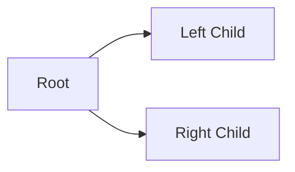

# Trees Graph Traversal
=====================================================

## Introduction
---------------

Graph traversal refers to the process of visiting each node or vertex in a graph, tree, or network data structure. In trees, traversal involves exploring the nodes and edges systematically to extract information or perform operations. There are three primary types of tree traversals: Preorder, Postorder, and Inorder.

## Core Concepts
----------------

### Tree Representation

A tree can be represented as an array of nodes, where each node contains:

*   **Value**: The data stored in the node.
*   **Left Child**: Pointer to the left child node (if any).
*   **Right Child**: Pointer to the right child node (if any).

### Traversal Methods

#### Preorder Traversal

Preorder traversal visits the current node before exploring its children. This is equivalent to the recursive process of traversing a tree, where each node is visited immediately after it's created.

1.  **Root Node**: Start with the root node.
2.  **Left Subtree**: Traverse the left subtree recursively (if any).
3.  **Right Subtree**: Traverse the right subtree recursively (if any).

#### Postorder Traversal

Postorder traversal visits the current node after exploring its children.

1.  **Left Subtree**: Traverse the left subtree recursively (if any).
2.  **Right Subtree**: Traverse the right subtree recursively (if any).
3.  **Root Node**: Visit the root node last.

#### Inorder Traversal

Inorder traversal visits the left child, then the current node, and finally the right child.

1.  **Left Child**: Traverse the left child (if any).
2.  **Current Node**: Visit the current node.
3.  **Right Child**: Traverse the right child (if any).

### Example: Binary Tree Representation

## Key Formulas/Theorems
-------------------------

No specific formulas or theorems are required for tree traversal.

## Problem Solving Patterns
-----------------------------

When solving problems related to tree traversal:

*   Understand the type of traversal required (preorder, postorder, inorder).
*   Identify the root node and its children.
*   Apply the traversal rules recursively or iteratively.
*   Use a systematic approach to visit each node.

## Examples with Solutions
---------------------------

### Example 1: Preorder Traversal

Given a binary tree:

Perform preorder traversal:

*   Start with the root node `A`.
*   Traverse left subtree (none).
*   Traverse right subtree (none).

Preorder traversal sequence: `A B C`.

### Example 2: Postorder Traversal

Given a binary tree:

Perform postorder traversal:

*   Traverse left subtree (none).
*   Traverse right subtree (none).
*   Visit the root node `A`.

Postorder traversal sequence: `B C A`.

## Common Pitfalls
-------------------

Avoid missing or misinterpreting the type of traversal required.

## Quick Summary
-----------------

*   Trees can be traversed in three ways: preorder, postorder, and inorder.
*   Preorder traversal visits the root node before its children.
*   Postorder traversal visits the root node after its children.
*   Inorder traversal visits the left child, then the current node, and finally the right child.

This summary will help you quickly recall key concepts for tree traversal.