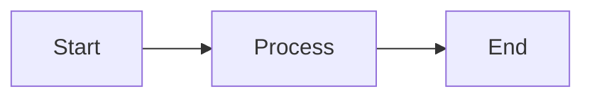

# Finite Automata and Regular Expression
======================================================

## Introduction

Finite automata (FA) are mathematical models that can be used to recognize patterns in strings, such as regular expressions. They consist of a set of states, transitions between these states based on input symbols, and an initial and final state.

Regular expressions, on the other hand, are a way to describe patterns using a formal language. They are commonly used in text processing and pattern matching.

## Core Concepts

### Finite Automata

A finite automaton (FA) is defined as follows:

* A set of states $Q$
* An initial state $q_0 \in Q$
* A set of transition functions $\delta: Q \times \Sigma \to Q$, where $\Sigma$ is the input alphabet
* A set of final states $F \subseteq Q$

A string $w = a_1a_2...a_n$ is accepted by an FA if there exists a sequence of transitions from the initial state to one of the final states, labeled with the input symbols.

### Regular Expressions

Regular expressions are defined recursively as follows:

* $\emptyset$: the empty set
* $a$: the string consisting of the single character $a$
* $(r_1|r_2)$: the union of the languages described by $r_1$ and $r_2$
* $(r_1 \cdot r_2)$: the concatenation of the languages described by $r_1$ and $r_2$
* $r^*$: the Kleene star, describing the set of strings that can be obtained by concatenating zero or more strings from the language described by $r$

### Regular Expression Equivalence

Two regular expressions are equivalent if they describe the same language. This is a key concept in understanding regular expressions.

## Key Formulas/Theorems

* The **Myhill-Nerode theorem**: A language is regular if and only if it has a finite number of distinct equivalence classes under the relation $x \equiv y$ if and only if $xy \in L$.
* The **pumping lemma for regular languages**: If $L$ is a regular language, then there exists a constant $p$ such that for all strings $w \in L$, if $|w| \geq p$, then there exist strings $x, y, z$ and integers $i, j$ such that $|xy| < p$, $|y| > 0$, $x^iy^jz \in L$ for all $i, j \geq 0$, and $w = x^iy^jz$.

## Problem Solving Patterns

### Analyzing Finite Automata

When analyzing FA, follow these steps:

1. Draw a transition diagram
2. Identify the initial and final states
3. Determine if there is an accepting path from the initial state to one of the final states for any input string

### Regular Expression Simplification

When simplifying regular expressions, follow these steps:

1. Apply the Kleene star law: $r^* = (r \cdot r^*)^+$
2. Use the union law: $(r_1|r_2) = (r_1 \cup r_2)$
3. Apply the concatenation law: $(r_1 \cdot r_2) = (r_1 \cdot (r_2))^+$

## Examples with Solutions

### Example 1: FA Acceptance

Suppose we have an FA with states $\{q_0, q_1\}$, initial state $q_0$, and final state $q_1$. The transition function is defined as follows:

$$\delta(q_0, a) = q_1 \quad \text{and} \quad \delta(q_0, b) = q_0$$

Determine if the string "ab" is accepted by this FA.

* **Solution**: Yes. From the initial state $q_0$, we can transition to $q_1$ on input "a", and then stay in $q_1$ on input "b".

### Example 2: Regular Expression Simplification

Suppose we have a regular expression $(ab^*)|(ba^*)$. Simplify this expression.

* **Solution**: Using the union law, we can rewrite this as $(ab^*\cup ba^*)$. Then using the concatenation law, we get $((a \cup b) (b^* \cup a^*))$.

## Common Pitfalls

### FA Acceptance

* Be careful when analyzing FA to ensure that you are considering all possible accepting paths.
* Don't confuse the initial state with any other state in the FA.

### Regular Expression Simplification

* Be aware of the Kleene star law and apply it when simplifying expressions involving $r^*$.
* Use the union and concatenation laws carefully, as they can lead to complex expressions.

## Quick Summary

* Finite automata: recognize patterns in strings
* Regular expressions: describe patterns using a formal language
* Key concepts:
	+ States and transitions in FA
	+ Union, concatenation, and Kleene star laws in regular expressions
* Common pitfalls:
	+ Analyzing FA acceptance
	+ Simplifying regular expressions

## References

* Sipser, M. (1997). Introduction to the theory of computation. PWS Publishing.
* Hopcroft, J. E., & Ullman, J. D. (1979). Formal languages and their relation to automata. Addison-Wesley.

Note: The references provided are classic texts in the field of theoretical computer science. They cover the topics of finite automata and regular expressions in depth.

**Mermaid Diagrams**

This diagram illustrates a simple flowchart with three states: start, process, and end.