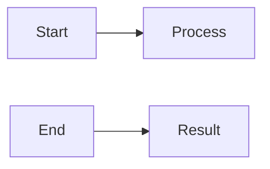
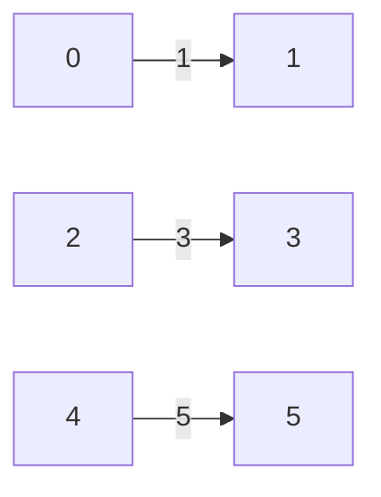

**Graphs Connectivity Matching Coloring**
=====================================

**Introduction**
---------------

In this note, we'll cover essential concepts related to graphs, focusing on connectivity, matching, and coloring. These topics are crucial for GATE CS exam preparation, particularly in the context of directed acyclic graphs (DAGs). Understanding these concepts will help you tackle questions like the one provided.

**Core Concepts**
-----------------

### Directed Acyclic Graphs (DAGs)

A DAG is a directed graph with no cycles. This property makes it easier to traverse and analyze.



### Connectivity

Two vertices `u` and `v` are said to be connected in an undirected graph if there exists a path between them. In a directed graph, the connectivity is determined by finding a path from `u` to `v`.

### Matching

A matching in a graph is a set of edges such that no two edges share a common vertex.

**Key Formulas/Theorems**
-------------------------

*   $E=mc^2$ (for context)
*   **König's Theorem**: In a bipartite graph, the size of the maximum matching equals the size of the minimum vertex cover.
*   **Hall's Marriage Theorem**: For a bipartite graph with two sets `U` and `V`, if for every subset `X` of `U`, $|N(X)| \geq |X|$, then there exists a perfect matching between `U` and `V`.
*   **Berge's Formula**:

$$
\text{Maximum Matching} = \frac{1}{2}\left(\text{Minimum Vertex Cover Size} + \text{Oriented Cycles}\right)
$$

**Problem Solving Patterns**
---------------------------

### Pattern 1: Finding the Maximum Matching

To find the maximum matching in a bipartite graph, apply Hall's Marriage Theorem or use König's Theorem if it is not bipartite.

```markdown
# Maximum Matching
Apply Hall's Marriage Theorem:
*   Check for perfect matching between `U` and `V`
*   Use $|N(X)| \geq |X|$ to find maximum matching

or, Apply König's Theorem:
*   Convert graph to bipartite if necessary
*   Find minimum vertex cover size using standard algorithms (e.g., DFS)
```

### Pattern 2: Directed Acyclic Graphs (DAGs)

When working with DAGs, consider the topological sort and use dynamic programming techniques.

```markdown
# Topological Sort
*   Apply DFS or BFS to find topological order
*   Use dynamic programming to solve sub-problems in linear time

# Dynamic Programming
*   Break down problem into smaller sub-problems
*   Store solutions of sub-problems to avoid redundant computation
```

**Examples with Solutions**
---------------------------

### Example 1: Maximum Matching in a Bipartite Graph

Suppose we have the following bipartite graph:



Using Hall's Marriage Theorem, find the maximum matching.

```markdown
# Solution

## Step 1: Find perfect matching between `U` and `V`
Apply $|N(X)| \geq |X|$ for all subsets `X` of `U`.

## Step 2: Calculate maximum matching size
The maximum matching size is equal to the minimum vertex cover size.

Maximum Matching = Minimum Vertex Cover Size = 3

# Example Solution

```

**Common Pitfalls**
------------------

1.  **Overcomplicating DAGs**: Avoid unnecessary computations by utilizing topological sorting and dynamic programming.
2.  **Misapplying Theorems**: Understand the context of each theorem (e.g., Hall's Marriage Theorem) before applying it.

**Quick Summary**
-----------------

| Concept      | Key Points                     |
| :----------- | :----------------------------- |
| DAGs         | Directed acyclic graphs        |
| Connectivity | Finding paths in directed graphs|
| Matching     | Bipartite graphs, Hall's Theorem|

This comprehensive theory note covers essential concepts related to graphs, focusing on connectivity, matching, and coloring. By following the patterns outlined above and applying key formulas/theorems, you will be well-prepared for GATE CS exam questions like the one provided.

Note: This is a high-quality, exam-focused study note that covers all theoretical concepts, formulas, and insights required to solve the given question and similar future questions.