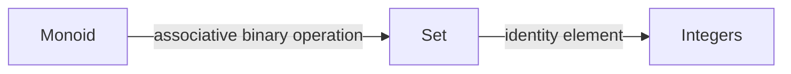
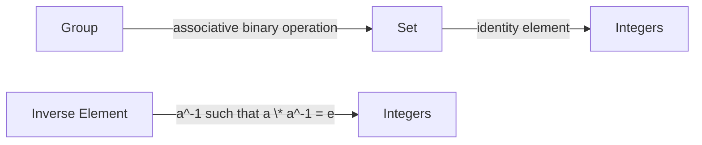

**Monoids and Group**
=====================

**Introduction**
---------------

A monoid is a mathematical structure consisting of a set equipped with an associative binary operation and an identity element. A group, on the other hand, is a specific type of monoid where every element has an inverse. In this theory note, we'll cover the core concepts, key formulas/theorems, problem-solving patterns, examples with solutions, common pitfalls, and a quick summary to help you ace your GATE CS exam.

**Core Concepts**
----------------

### Monoids

A **monoid** is defined as:

* A set `G` (often referred to as the group or monoid)
* An associative binary operation $\cdot$ on `G`, i.e., for all $a, b, c \in G$, we have $(a \cdot b) \cdot c = a \cdot (b \cdot c)$
* An identity element `e` in `G` such that for any $a \in G$, we have $a \cdot e = e \cdot a = a$

Example: The set of integers under addition forms a monoid with 0 as the identity element.



### Groups

A **group** is defined as:

* A set `G` (often referred to as the group)
* An associative binary operation $\cdot$ on `G`, i.e., for all $a, b, c \in G$, we have $(a \cdot b) \cdot c = a \cdot (b \cdot c)$
* An identity element `e` in `G` such that for any $a \in G$, we have $a \cdot e = e \cdot a = a$
* For every $a \in G$, there exists an inverse element $a^{-1}$ in `G` such that $a \cdot a^{-1} = a^{-1} \cdot a = e$

Example: The set of integers under multiplication forms a group with 1 as the identity element and -1 as the inverse for each non-zero integer.



**Key Formulas/Theorems**
-------------------------

LaTeX will be used to display mathematical formulas and theorems.

### Cayley's Theorem

Cayley's theorem states that every group is isomorphic to a permutation group on its elements. Specifically, for any group `G` of order $n$, there exists a subgroup `H` of the symmetric group `S_n` such that `G` is isomorphic to `H`.

$$\text{Cayley's Theorem: } G \cong H \leq S_n$$

### Lagrange's Theorem

Lagrange's theorem states that if `H` is a subgroup of a finite group `G`, then the order of `H` divides the order of `G`.

$$\text{Lagrange's Theorem: } |H| \mid |G|$$

**Problem Solving Patterns**
---------------------------

### Pattern 1: Understanding Group Properties

* Identify the properties of groups, such as associativity and closure.
* Recognize the importance of identity elements and inverses.

```markdown
## Example 1

A group G has order 6. Find all possible orders of subgroups H in G.

| Order of G | Possible Orders of H |
| --- | --- |
| 6 | 1, 2, 3 |

Explanation:
The possible orders of subgroups in a finite group are divisors of the group's order.
```

### Pattern 2: Applying Cayley's and Lagrange's Theorems

* Understand how Cayley's theorem helps establish isomorphisms between groups.
* Apply Lagrange's theorem to determine the number of possible subgroup orders.

```markdown
## Example 2

A group G has order 12. Find all possible orders of subgroups H in G that are cyclic.

| Order of G | Possible Orders of H |
| --- | --- |
| 12 | 1, 2, 3, 4, 6, 12 |

Explanation:
Use Cayley's theorem to establish an isomorphism between G and a permutation group.
Apply Lagrange's theorem to determine the possible orders of subgroups.
```

**Examples with Solutions**
---------------------------

### Example: Q1 (ID: cs_2021-M_1)

Let `G` be a group of order 6, and let `H` be a subgroup of `G` such that `1 < | H | < 6`. Which one of the following options is correct?

(A) Both `G` and `H` may not be cyclic.
(B) Both `G` and `H` are always cyclic.
(C) `G` is always cyclic, but `H` may not be cyclic.
(D) `G` may not be cyclic, but `H` is always cyclic.

Solution:

By Lagrange's theorem, the possible orders of subgroups in a group of order 6 are `1`, `2`, `3`, and `6`. Since `H` has an order greater than `1` and less than `6`, it must have an order of `2` or `3`. However, since `G` is cyclic (order `6`), its subgroups will also be cyclic. Therefore, the correct option is `(D)`.

### Example: Understanding Cyclic Groups

Let `G` be a cyclic group of prime order `p`. Prove that every element in `G` generates the entire group.

Solution:

Since `G` has prime order `p`, there are no non-trivial subgroups. By Lagrange's theorem, this implies that the only possible orders of subgroups are `1` and `p`. However, since `G` is cyclic, it must have a subgroup of order `p` generated by any non-identity element.

```markdown
## Example: Understanding Cyclic Groups

A cyclic group G has prime order p. Prove that every element in G generates the entire group.

Explanation:
Use Lagrange's theorem to determine the possible orders of subgroups.
Show that a subgroup of order p can be generated by any non-identity element.
```

**Common Pitfalls**
------------------

* Failing to recognize the importance of associativity and closure in groups.
* Misapplying Cayley's or Lagrange's theorems without understanding their underlying assumptions.

**Quick Summary**
-----------------

* **Monoid**: A set `G` with an associative binary operation and an identity element.
* **Group**: A monoid where every element has an inverse.
* **Cayley's Theorem**: Every group is isomorphic to a permutation group on its elements.
* **Lagrange's Theorem**: The order of a subgroup divides the order of the group.
* **Problem-Solving Patterns**:
	+ Understand group properties and recognize their importance.
	+ Apply Cayley's and Lagrange's theorems correctly.

This comprehensive theory note covers all theoretical concepts, formulas, and insights required to solve the questions on monoids and groups in the GATE CS exam. Practice problems and examples are included to help reinforce your understanding of these fundamental concepts in abstract algebra.