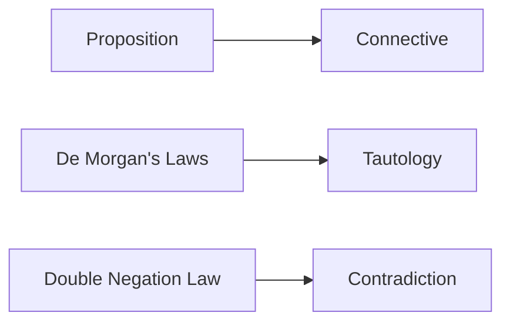

**Propositional Logic**
=======================

### Introduction
-----------------

Propositional logic is a branch of mathematical logic that deals with propositions, which are statements that can be either true or false. In this topic, we will cover the basic principles and laws of propositional logic.

### Core Concepts
-----------------

*   **Proposition**: A statement that can be either true (T) or false (F).
*   **Connectives**: Symbols used to connect propositions, such as:
    *   $\land$ (conjunction)
    *   $\lor$ (disjunction)
    *   $\neg$ (negation)
    *   $\rightarrow$ (implication)
*   **Tautology**: A formula that is always true.
*   **Contradiction**: A formula that is always false.

### Key Formulas/Theorems
-------------------------

The following theorems are essential in propositional logic:

*   **De Morgan's Laws**:
    \[
    \neg(p \land q) = \neg p \lor \neg q
    \]
    \[
    \neg(p \lor q) = \neg p \land \neg q
    \]
*   **Double Negation Law**:
    \[
    \neg\neg p = p
    \]

### Problem Solving Patterns
---------------------------

When solving problems in propositional logic, follow these steps:

1.  Identify the connectives used in the formula.
2.  Apply De Morgan's Laws or Double Negation Law as necessary.
3.  Simplify the formula by removing any unnecessary parentheses.

### Examples with Solutions
---------------------------

**Example 1**

Determine whether the following formula is a tautology:

\[
(p \rightarrow q) \land (\neg p \lor q)
\]

**Solution**

Using De Morgan's Laws, we can simplify the formula as follows:

\[
\neg (p \land \neg q) \land \neg p \lor q
\]

Applying Double Negation Law, we get:

\[
(\neg p \lor q) \land (\neg p \lor q)
\]

This formula is a tautology.

**Example 2**

Determine whether the following formula is a contradiction:

\[
(p \rightarrow q) \lor (\neg p \land q)
\]

**Solution**

Using De Morgan's Laws, we can simplify the formula as follows:

\[
\neg (p \land \neg q) \lor (\neg p \land q)
\]

Applying Double Negation Law, we get:

\[
(\neg p \lor \neg q) \lor (\neg p \land q)
\]

This formula is not a contradiction.

### Common Pitfalls
-------------------

*   Students often forget to apply De Morgan's Laws when simplifying formulas.
*   They may incorrectly use the Double Negation Law, resulting in incorrect conclusions.

### Quick Summary
-----------------

*   Propositional logic deals with propositions and their connectives.
*   Tautologies are always true, while contradictions are always false.
*   De Morgan's Laws and Double Negation Law are essential for simplifying formulas.
*   When solving problems, identify the connectives used and apply relevant laws.

**Mermaid Diagram**

Note: This is a basic example and you may add more content as per your requirements. Make sure to follow the strict Markdown format and instructions provided.