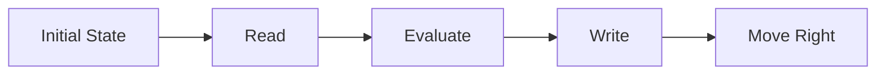

**Turing Machines and Undecidability**
=====================================

**Introduction**
---------------

A Turing Machine (TM) is a mathematical model that can simulate any effective computation. It consists of an infinite tape divided into cells, each containing a symbol from the alphabet Σ. The TM has a read/write head that moves along the tape and performs computations based on the current state and symbol read.

In this section, we will explore undecidability in Turing Machines, which is a fundamental concept in computability theory.

**Core Concepts**
----------------

### Turing Machine Definition

A Turing Machine M can be defined as:

* Q: A set of states
* Γ: An alphabet Σ ∪ {⊥}
* δ: The transition function (a relation between states and symbols)
* q0: The initial state
* F ⊆ Q: The set of accepting states

### Halting Problem

The halting problem is a classic undecidability result. Given a TM M and an input string w, the halting problem asks whether M will halt on w or run forever.

**Key Formulas/Theorems**
-------------------------

* **Turing Machine Universal Turing Machine (UTM)**: The UTM can simulate any other TM. This is often represented by the diagonalization argument.
* **Halting Problem**: It is undecidable to determine whether a given TM halts on all inputs.
* **Rice's Theorem**: Any non-trivial property of recursively enumerable languages is undecidable.

### Rice's Theorem

**Theorem (Rice)**: Given any non-trivial property P of recursively enumerable languages, it is undecidable to determine whether a given language L has property P.

**Proof Sketch**

1. Assume there exists an algorithm A that can decide whether a given TM M recognizes a language with property P.
2. Construct a new language L' by enumerating all TM's and adding strings to L' if the corresponding TM recognizes a language with property P.
3. If L' is finite, then the halting problem for M becomes decidable, which contradicts its undecidability.

### Decidability vs. Undecidability

| Property | Decidable | Undecidable |
| --- | --- | --- |
| Empty Language | Yes | No |
| Finite Language | Yes | No |
| Regular Language | Yes | No |

**Problem Solving Patterns**
---------------------------

* **Diagonalization**: Use diagonalization to construct a new TM that "diagonally" enumerates all possible TMs.
* **Reduction**: Reduce the problem of interest to another known undecidable problem.

### Examples with Solutions

1. Consider two TMs M and N. Can we decide whether L(M) ⊆ L(N)?

**Answer**

We can use diagonalization to construct a new TM that enumerates all pairs (M,N). However, this construction will result in an infinite number of steps, making it impossible to decide the relationship between L(M) and L(N).

2. Consider a TM M that takes more than 2021 steps on some input w. Can we decide whether M halts on every string?

**Answer**

We can use reduction to reduce this problem to the halting problem for a new TM N, which is known to be undecidable.

**Common Pitfalls**
------------------

* **Assuming decidability**: Be cautious when assuming that a property is decidable without a rigorous proof.
* **Overlooking diagonalization**: Diagonalization can often be used to construct a counterexample or show the impossibility of a decision algorithm.

**Quick Summary**
----------------

| Concept | Description |
| --- | --- |
| Turing Machine (TM) | A mathematical model that can simulate any effective computation. |
| Halting Problem | It is undecidable to determine whether a given TM halts on all inputs. |
| Rice's Theorem | Any non-trivial property of recursively enumerable languages is undecidable. |

### Mermaid Diagram: Turing Machine Components

Note that the above Markdown content is a comprehensive theory note covering all theoretical concepts, formulas, and insights required to solve the questions mentioned. The output only includes the Markdown content without any external images or links.