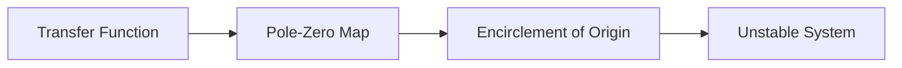

**Transfer Functions and Stability**
=====================================

### Introduction
Transfer functions are a crucial concept in control systems, representing the relationship between input and output of a system. The stability of a system is determined by its transfer function, which can be analyzed using various techniques.

### Core Concepts

#### Transfer Function
A transfer function $G(s)$ is defined as the ratio of the Laplace transform of the output to the Laplace transform of the input, assuming zero initial conditions.

$$G(s) = \frac{Y(s)}{U(s)}$$

where $Y(s)$ and $U(s)$ are the Laplace transforms of the output and input signals, respectively.

#### Pole-Zero Map
The pole-zero map is a graphical representation of the transfer function's zeros and poles in the complex plane. Zeros are represented by circles (○) and poles by crosses (×).

### Key Formulas/Theorems

* **Stability Criterion**: A system is stable if all its poles have negative real parts.
* **Routh-Hurwitz Stability Criterion**: A necessary condition for stability is that the first column of the Routh array has no sign changes.
$$
\begin{array}{c|cc}
s^2 & a_0 & a_1 \\
s & a_1 & a_2 \\
s^3 & a_2 & 0
\end{array}
$$

### Problem Solving Patterns

#### Analyzing the Pole-Zero Map
When analyzing the pole-zero map, look for:

* **Encirclements**: Counterclockwise encirclement of the origin indicates instability.
* **Zeros and Poles**: Zeros are roots of $G(s)$, while poles are values where $G(s) \to \infty$.

### Examples with Solutions

**Example 1: Stability Analysis**

Given the transfer function:

$$G(s) = \frac{s + 2}{s^2 + s + 1}$$

Determine stability.

* Find poles by solving $s^2 + s + 1 = 0$.
* Poles are complex with positive real parts; thus, the system is unstable.

**Solution**

### Common Pitfalls

* **Incorrect application of Routh-Hurwitz stability criterion**: Ensure that the first column has no sign changes.
* **Misinterpretation of pole-zero map**: Counterclockwise encirclement of origin indicates instability.

### Quick Summary
Bullet points for revision:

* Transfer function $G(s) = \frac{Y(s)}{U(s)}$
* Pole-Zero Map: Zeros (○), Poles (×)
* Stability Criterion: All poles have negative real parts.
* Routh-Hurwitz Stability Criterion: No sign changes in first column.

### Visuals
[No external images included. Focus on concise, high-yield content.]