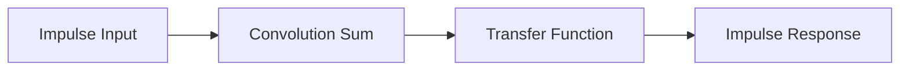

**Discrete Time Systems**
=========================

**Introduction**
---------------

A discrete-time system is a mathematical model that deals with signals and systems that are defined at specific, discrete points in time. This concept is essential in digital signal processing, control systems, and communication networks.

**Core Concepts**
-----------------

### Discrete-Time Signals

* A discrete-time signal is represented by a sequence of values, `x[n]`, where `n` is an integer.
* The input signal is denoted as `x[n]`, and the output signal is denoted as `y[n]`.

### Impulse Response

* The unit impulse response of a system is the output when the input is a unit impulse signal, `δ[n]`.
* It represents how the system responds to a sudden change or an impulsive input.

**Key Formulas/Theorems**
-------------------------

$$
\begin{align*}
y[n] &= \sum_{k=-\infty}^{\infty} h[k]x[n-k]\\
H(e^{j\omega}) &= \sum_{n=-\infty}^{\infty} h[n]e^{-j\omega n}
\end{align*}
$$

where `h[n]` is the impulse response of the system, and `H(e^{j\omega})` is the transfer function.

**Problem Solving Patterns**
---------------------------

### Impulse Response Analysis

When analyzing the unit impulse response of a discrete-time system, follow these steps:

1. Identify the input signal as a unit impulse signal.
2. Compute the output signal using the convolution sum formula.
3. Interpret the resulting impulse response.

**Examples with Solutions**
-------------------------

### Example 1: Impulse Response Analysis

Suppose we have a discrete-time system with an impulse response `h[n] = δ[n]`. Find the transfer function and impulse response of this system.

Using the convolution sum formula, we get:

$$y[n] = \sum_{k=-\infty}^{\infty} h[k]x[n-k] = x[n]$$

The transfer function is therefore `H(e^{j\omega}) = 1`. The impulse response is simply the input signal itself.

### Example 2: Discrete-Time Convolution

Suppose we have two discrete-time signals, `x[n]` and `y[n]`, with corresponding impulse responses `h_x[n]` and `h_y[n]`. Find the convolution of these two signals using the convolution sum formula.

Using the convolution sum formula, we get:

$$y[n] = \sum_{k=-\infty}^{\infty} h_x[k]x[n-k] * \sum_{l=-\infty}^{\infty} h_y[l]y[n-l]$$

**Common Pitfalls**
------------------

* Confusing discrete-time signals with continuous-time signals.
* Failing to account for the unit impulse response in convolution operations.

**Quick Summary**
-----------------

• Discrete-time systems model signals and systems at specific, discrete points in time.
• Impulse response analysis is essential in understanding how a system responds to an impulsive input.
• Convolution sum formula is used to compute output signals from inputs.
• Transfer function represents the frequency response of a system.