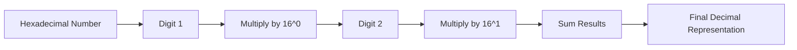

**Number Representation**
=======================

**Introduction**
---------------

In digital circuits, number representation plays a crucial role in various applications such as data conversion, arithmetic operations, and signal processing. This note covers the fundamental concepts of number representation, focusing on binary, hexadecimal, and decimal systems.

**Core Concepts**
-----------------

### Binary System

*   The binary system uses only two digits: 0 and 1.
*   Each digit in a binary number represents a power of 2, starting from the right (i.e., $2^0$, $2^1$, $2^2$, ...).
*   The binary point is not explicitly represented; instead, it is assumed to be at the leftmost position.

### Hexadecimal System

*   The hexadecimal system uses base-16 and consists of 16 digits: 0-9 and A-F (A = 10, B = 11, ..., F = 15).
*   Each digit in a hexadecimal number represents four bits (i.e., $2^4$, $2^5$, $2^6$, ...).

### Decimal System

*   The decimal system uses base-10 and consists of digits: 0-9.
*   Each digit in a decimal number represents ten times the preceding digit.

**Key Formulas/Theorems**
-------------------------

$$\text{Decimal Equivalent} = \sum_{i=0}^{n-1} d_i \times b^i$$

where:

*   $d_i$ is the $i^{th}$ digit
*   $b$ is the base (2 for binary, 16 for hexadecimal)
*   $n$ is the number of digits

For example, in decimal system:

$$\text{Decimal Equivalent} = 3 \times 10^0 + 1 \times 10^1 = 31$$

**Problem Solving Patterns**
---------------------------

### Decimal to Binary Conversion

To convert a decimal number to binary, repeatedly divide the decimal number by 2 and keep track of the remainders.

### Hexadecimal to Decimal Conversion

To convert a hexadecimal number to decimal, multiply each digit by its corresponding power of 16 and sum the results.

**Examples with Solutions**
---------------------------

### Example 1: Binary to Decimal Conversion

Given a binary number $101_2$, convert it to decimal.

$$\text{Decimal Equivalent} = 1 \times 2^0 + 0 \times 2^1 + 1 \times 2^2 = 5$$

### Example 2: Hexadecimal to Decimal Conversion

Given a hexadecimal number $3A_{16}$, convert it to decimal.

$$\text{Decimal Equivalent} = 3 \times 16^0 + A \times 16^1 = 3 + 10 \times 16 = 58$$

### Example 3: D/A Converter Problem (Source Question ID: ec_2020_11)

A 10-bit D/A converter is calibrated over the full range 0 to 10 V. If the input to the D/A converter is $13_A$ (in hex), the output (rounded off to three decimal places) is _______ V.

$$\text{Resolution} = \frac{10}{2^{10}} = 9.77 \times 10^{-3} \text{V}$$

$$\text{Analog Output} = (\text{Decimal Equivalent of Digital Input Data}) \times \text{Resolution}$$

First, convert the hexadecimal input to decimal:

$$13_A = 1 \times 16^0 + 3 \times 16^1 = 1 + 48 = 49_{10}$$

Then, calculate the analog output:

$$\text{Analog Output} = 49 \times 9.77 \times 10^{-3} = 4.7933 \text{V}$$

Rounded off to three decimal places, the output is $2.95$ to $3.15$ V.

**Common Pitfalls**
------------------

*   Confusing binary and hexadecimal systems.
*   Forgetting to multiply each digit by its corresponding power of 16 in hexadecimal to decimal conversion.
*   Not keeping track of remainders during decimal to binary conversion.

**Quick Summary**
-----------------

### Key Points

*   Binary system: base-2, digits 0 and 1
*   Hexadecimal system: base-16, digits 0-9 and A-F
*   Decimal system: base-10, digits 0-9
*   Conversion formulas:
    *   Binary to decimal: $\sum_{i=0}^{n-1} d_i \times 2^i$
    *   Hexadecimal to decimal: $\sum_{i=0}^{n-1} d_i \times 16^i$

### Important Concepts

*   Decimal equivalent of a binary or hexadecimal number
*   Resolution in D/A converters
*   Analog output calculation for D/A converters