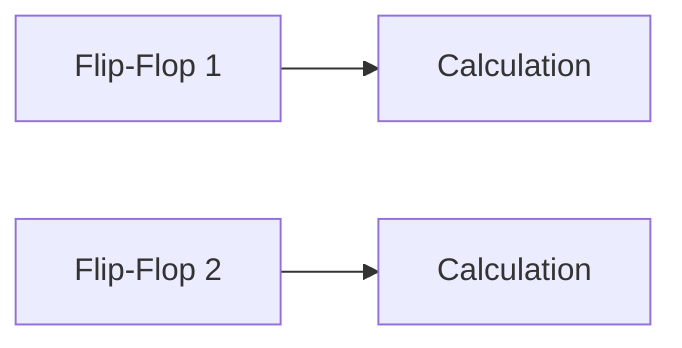
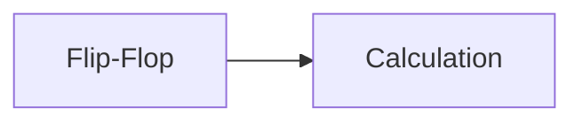

# Sequential Circuits
=====================

## Introduction
------------

Sequential circuits are a fundamental concept in digital electronics, where the output of the circuit depends not only on the current input but also on the past inputs. This type of circuit is essential in designing digital systems that require memory and sequential logic.

## Core Concepts
----------------

### Flip-Flops
A flip-flop is a basic building block of sequential circuits. It's a bistable device that can store a single bit of information, either 0 or 1. There are several types of flip-flops, including:

* D-type flip-flop (DFF)
* JK flip-flop
* T flip-flop

Each type has its own characteristics and applications.

### Flip-Flop Operation
A flip-flop operates based on the following principles:

* **Set** operation: Sets the output to 1.
* **Reset** operation: Resets the output to 0.
* **Clock** operation: Controls when the flip-flop changes its state.

## Key Formulas/Theorems
-----------------------

### Propagation Delay (pd)
The time it takes for a signal to propagate through a circuit. It's denoted by `pd` and is typically measured in nanoseconds (ns).

### Setup Time (`s`)
The minimum time required between the clock edge and the data input to ensure that the flip-flop changes its state correctly.

*   **Setup Time Formula:** $t_s = pd + t_d$

    where:
    *   `t_s` is the setup time
    *   `pd` is the propagation delay
    *   `t_d` is the data input delay

### Hold Time (`h`)
The minimum time required between the clock edge and the data input to ensure that the flip-flop retains its state correctly.

*   **Hold Time Formula:** $t_h = pd - t_d$

    where:
    *   `t_h` is the hold time
    *   `pd` is the propagation delay
    *   `t_d` is the data input delay

## Problem Solving Patterns
---------------------------

### Calculating Maximum Clock Frequency
To calculate the maximum clock frequency, we need to consider the setup and hold times.

*   **Maximum Clock Frequency Formula:** $f_{max} = \frac{1}{(t_s + t_h)}$

    where:
    *   `f_max` is the maximum clock frequency
    *   `t_s` is the setup time
    *   `t_h` is the hold time

## Examples with Solutions
---------------------------

### Example 1:

Given a sequential circuit with the following parameters:

*   Flip-flop 1: $pd = 2ns$, $t_d = 1ns$
*   Flip-flop 2: $pd = 4ns$, $t_d = 3ns$

Calculate the maximum clock frequency.

Solution:

*   Calculate setup time for Flip-flop 1: $t_s = pd + t_d = 2ns + 1ns = 3ns$
*   Calculate hold time for Flip-flop 1: $t_h = pd - t_d = 2ns - 1ns = 1ns$

Now, calculate the maximum clock frequency:

$f_{max} = \frac{1}{(t_s + t_h)} = \frac{1}{3ns + 1ns} = \frac{1}{4ns}$

### Example 2:

Given a sequential circuit with the following parameters:

*   Flip-flop: $pd = 5ns$, $t_d = 3ns$

Calculate the maximum clock frequency.

Solution:

*   Calculate setup time for Flip-flop: $t_s = pd + t_d = 5ns + 3ns = 8ns$
*   Calculate hold time for Flip-flop: $t_h = pd - t_d = 5ns - 3ns = 2ns$

Now, calculate the maximum clock frequency:

$f_{max} = \frac{1}{(t_s + t_h)} = \frac{1}{8ns + 2ns} = \frac{1}{10ns}$

## Common Pitfalls
-----------------

*   Failing to consider both setup and hold times when calculating the maximum clock frequency.
*   Not using the correct propagation delay values for each flip-flop.

## Quick Summary
---------------

### Key Concepts:

*   Sequential circuits rely on memory elements (flip-flops) that retain information between clock cycles.
*   Flip-flops have different types, including D-type, JK, and T flip-flops.

### Key Formulas/Theorems:

*   Propagation delay (`pd`): the time it takes for a signal to propagate through a circuit.
*   Setup time (`t_s`): the minimum time required between the clock edge and data input to ensure correct state change.
*   Hold time (`t_h`): the minimum time required between the clock edge and data input to ensure correct state retention.

### Problem Solving Patterns:

*   Calculate maximum clock frequency using setup and hold times.

Remember, mastering sequential circuits is crucial for designing digital systems that require memory and sequential logic. Practice problems and examples will help you solidify your understanding of these concepts.