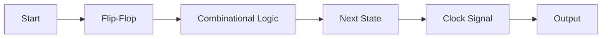

**Sequential Circuit**
=====================

### Introduction
----------------

A sequential circuit is a digital circuit that has memory and can store data. It uses flip-flops to remember the state of the circuit, and combinational logic to determine the next state based on the current state and inputs.

### Core Concepts
-----------------

#### Flip-Flops
--------------

Flip-flops are the basic building blocks of sequential circuits. They are digital storage elements that can store a binary value (0 or 1) and can be set or reset by clock signals.

There are several types of flip-flops, including:

* **D Flip-Flop**: A D flip-flop is a type of flip-flop where the output is equal to the input when the clock signal is high.
* **JK Flip-Flop**: A JK flip-flop is a type of flip-flop that can be used as a toggle or a latch.

#### Combinational Logic
-------------------------

Combinational logic is used in sequential circuits to determine the next state based on the current state and inputs. It consists of logic gates (AND, OR, NOT) and other digital components.

### Key Formulas/Theorems
----------------------------

* **Propagation Delay**: The time it takes for a signal to propagate through a circuit.
\[ \tau = \frac{d}{v} \]
where:
\( \tau \) is the propagation delay,
\( d \) is the distance between the inputs and outputs,
\( v \) is the speed of the signal.

### Problem Solving Patterns
-----------------------------

#### Sequential Circuit Design
--------------------------------

1. Determine the type of flip-flops needed.
2. Draw a block diagram of the sequential circuit.
3. Write the next state equations ( combinational logic).
4. Simplify the next state equations using Karnaugh maps or other methods.

### Examples with Solutions
-----------------------------

**Example 1:**
A D flip-flop has an input signal of 0 and is clocked at a frequency of 500 MHz. What is the minimum number of clock edges required for the output to change?

\[ f = 500 \text{ MHz} \]
\[ T_{\text{clock}} = \frac{1}{f} = \frac{1}{500 \times 10^6} = 2 \text{ ns} \]

Since the propagation delay of the D flip-flop is zero, it takes only one clock edge for the output to change.

### Common Pitfalls
-------------------

* Not considering the propagation delay of combinational logic.
* Using incorrect types of flip-flops.
* Not simplifying next state equations properly.

### Quick Summary
------------------

* Flip-flops store data and can be set or reset by clock signals.
* Combinational logic determines the next state based on the current state and inputs.
* Propagation delay is the time it takes for a signal to propagate through a circuit.
* Sequential circuits consist of flip-flops, combinational logic, and clock signals.

** Mermaid Diagram **

This mermaid diagram shows the basic structure of a sequential circuit.