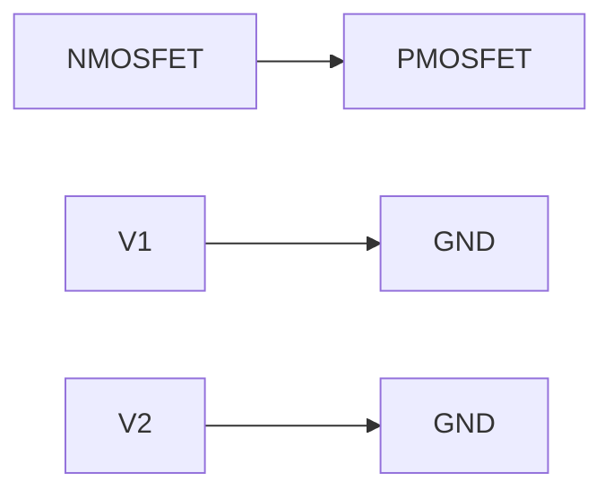
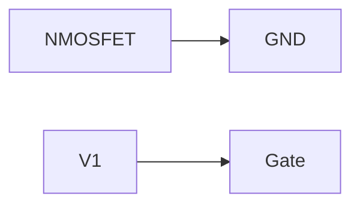

# Ideal Long Channel NMOSFET and PMOSFET Device
=============================================

## Introduction
---------------

The ideal long channel MOSFET (Metal-Oxide-Semiconductor Field-Effect Transistor) device is a fundamental component in modern electronics. It plays a crucial role in various digital circuits, including logic gates, arithmetic units, and memory cells. Understanding the behavior of NMOSFET and PMOSFET devices is essential for designing and analyzing electronic systems.

## Core Concepts
----------------

### MOSFET Structure

A MOSFET consists of four layers:

1.  **Gate**: A metal oxide layer that controls the flow of current.
2.  **Source**: One end of the channel, connected to the substrate.
3.  **Drain**: The other end of the channel, connected to the source through a resistor or directly.
4.  **Substrate**: The underlying material, usually silicon.

### Modes of Operation

A MOSFET operates in three modes:

1.  **Cut-off mode**: No current flows between the drain and source when the gate voltage is below the threshold voltage (Vth).
2.  **Triode mode**: Current flows between the drain and source with a small increase in gate voltage above Vth.
3.  **Saturation mode**: Maximum current flows between the drain and source when the gate voltage is significantly above Vth.

### Threshold Voltage

The threshold voltage (Vth) is the minimum gate voltage required to create an inversion layer in the channel, allowing current to flow. The sign of Vth determines whether the device is NMOSFET (+ve) or PMOSFET (-ve).

## Key Formulas/Theorems
------------------------

### NMOSFET and PMOSFET Id-Vgs Characteristics

The drain-to-source current (Id) is given by:

$$I_D = \frac{1}{2} \mu_n C_{ox} \frac{W}{L} (V_{GS} - V_{th})^2$$

$$I_D = \frac{1}{2} \mu_p C_{ox} \frac{W}{L} (-V_{SG} + |V_{th}|)^2$$

where:

*   μn and μp are the electron and hole mobilities, respectively.
*   Cox is the gate oxide capacitance per unit area.
*   W/L is the aspect ratio of the channel.

## Problem Solving Patterns
---------------------------

### NMOSFET and PMOSFET Circuit Analysis

To analyze a circuit containing MOSFETs, follow these steps:

1.  Determine the mode of operation for each device (cut-off, triode, or saturation).
2.  Calculate the drain-to-source current using the Id-Vgs characteristics.
3.  Use Kirchhoff's laws to analyze the circuit and determine the node voltages.

### Example: Circuit with NMOSFET and PMOSFET

Given a circuit with an NMOSFET (Vth = 1 V) and a PMOSFET (Vth = -1 V), connected as shown in the source question:

Assuming an initial discharge, determine the steady-state node voltages.

## Examples with Solutions
---------------------------

### Example 1: NMOSFET Circuit

Given a circuit with an NMOSFET (Vth = 1 V) and a voltage source (V1 = 5 V), connected as shown:

Determine the drain-to-source current using the Id-Vgs characteristics.

### Solution

Using the NMOSFET Id-Vgs characteristic, we have:

$$I_D = \frac{1}{2} \mu_n C_{ox} \frac{W}{L} (V_{GS} - V_{th})^2$$

Substituting values, we get:

$$I_D = \frac{1}{2} \times 10^{-1} \times 8.854 \times 10^{-12} \times \frac{W}{L} (5 - 1)^2$$

Simplifying and calculating the value of I_D, we find:

$$I_D = 0.0225 \, \text{A}$$

## Common Pitfalls
-------------------

*   Failing to determine the mode of operation for each device.
*   Incorrectly applying the Id-Vgs characteristics.
*   Neglecting initial discharge and leakage currents.

## Quick Summary
-----------------

### Key Points

*   MOSFET structure consists of four layers (gate, source, drain, substrate).
*   NMOSFET operates with a positive threshold voltage (Vth), while PMOSFET operates with a negative Vth.
*   Id-Vgs characteristics describe the relationship between drain-to-source current and gate voltage.
*   Circuit analysis involves determining the mode of operation for each device and applying Kirchhoff's laws.

### Key Formulas

*   NMOSFET Id-Vgs characteristic: $I_D = \frac{1}{2} \mu_n C_{ox} \frac{W}{L} (V_{GS} - V_{th})^2$
*   PMOSFET Id-Vgs characteristic: $I_D = \frac{1}{2} \mu_p C_{ox} \frac{W}{L} (-V_{SG} + |V_{th}|)^2$

By mastering these concepts and formulas, you will be well-prepared to tackle questions on ideal long channel NMOSFET and PMOSFET devices.