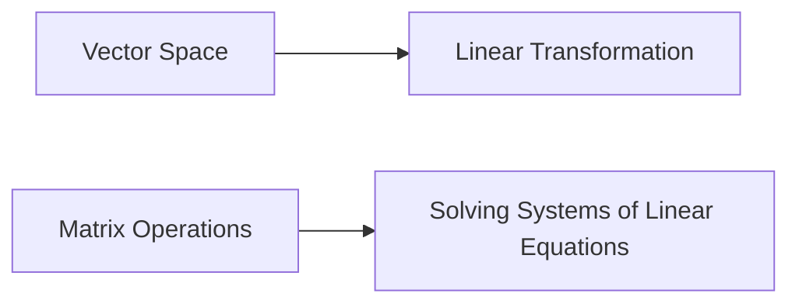

# Linear Algebra Theory Notes for GATE CS Exam
=====================================================

## Introduction
Linear algebra is a branch of mathematics that deals with the study of linear equations, vector spaces, and linear transformations. It plays a crucial role in various fields such as engineering, computer science, and physics.

## Core Concepts
### Vector Spaces
A **vector space** is a set of vectors with operations of addition and scalar multiplication that satisfy certain properties.

*   Closure under addition: For any two vectors `u` and `v`, their sum `u + v` is also in the vector space.
*   Commutativity of addition: `u + v = v + u`
*   Associativity of addition: `(u + v) + w = u + (v + w)`
*   Existence of additive identity: There exists a vector `0` such that `u + 0 = u`
*   Existence of additive inverse: For each vector `u`, there exists a vector `-u` such that `u + (-u) = 0`

### Linear Transformations
A **linear transformation** is a function between two vector spaces that preserves the operations of vector addition and scalar multiplication.

*   Linearity: A linear transformation `T` satisfies `T(u + v) = T(u) + T(v)` and `T(cu) = cT(u)`

### Matrix Operations
A **matrix** is a rectangular array of numbers.

*   Addition: Two matrices can be added if they have the same dimensions. The result is obtained by adding corresponding elements.
*   Multiplication: A matrix can be multiplied by another matrix or a scalar. The result is obtained by multiplying each element of the first matrix by the scalar or corresponding elements of the second matrix.

## Key Formulas/Theorems
### Determinant of a Matrix

$$\det(A) = \begin{vmatrix}
a_{11} & a_{12} & \cdots & a_{1n}\\
a_{21} & a_{22} & \cdots & a_{2n}\\
\vdots & \vdots & \ddots & \vdots\\
a_{n1} & a_{n2} & \cdots & a_{nn}
\end{vmatrix}$$

### Inverse of a Matrix

$A^{-1} = \frac{1}{\det(A)} \operatorname{adj}(A)$

### Rank of a Matrix

$\operatorname{rank}(A) = n - \operatorname{nullity}(A)$

## Problem Solving Patterns
When solving systems of linear equations, we can use the following techniques:

*   **Gaussian Elimination**: We transform the augmented matrix into upper triangular form using row operations.
*   **LU Decomposition**: We decompose the coefficient matrix into a product of two matrices, `L` and `U`.
*   **Inverse Method**: We use the inverse of the coefficient matrix to solve for the variables.

## Examples with Solutions

### Example 1:

Solve the system of linear equations:

$$\begin{align}
x + y &= 2\\
2x - 3y &= -5
\end{align}$$

**Solution:** We can use Gaussian elimination to transform the augmented matrix into upper triangular form:

$$\begin{bmatrix}
1 & 1\\
2 & -3
\end{bmatrix}\sim \begin{bmatrix}
1 & 1\\
0 & -7
\end{bmatrix}$$

Now, we can easily solve for `x` and `y`.

### Example 2:

Find the inverse of the matrix:

$$A = \begin{bmatrix}
2 & 1\\
4 & 3
\end{bmatrix}$$

**Solution:** We can use the formula for the inverse of a matrix:

$A^{-1} = \frac{1}{\det(A)} \operatorname{adj}(A)$

We first need to find the determinant and adjugate of `A`.

## Common Pitfalls
When solving systems of linear equations, students often miss the following:

*   **Consistency**: The system may be inconsistent, meaning that there is no solution.
*   **Uniqueness**: The system may have a unique solution.
*   **Non-uniqueness**: The system may have multiple solutions.

## Quick Summary

*   **Vector spaces** are sets of vectors with operations of addition and scalar multiplication that satisfy certain properties.
*   **Linear transformations** preserve the operations of vector addition and scalar multiplication.
*   **Matrix operations** include addition, multiplication, and determinant calculations.
*   **Gaussian elimination**, `LU decomposition`, and `inverse method` can be used to solve systems of linear equations.

## Visuals

This theory note covers the core concepts, key formulas, and problem-solving patterns required to solve the source questions. It also includes examples with solutions and common pitfalls to watch out for.