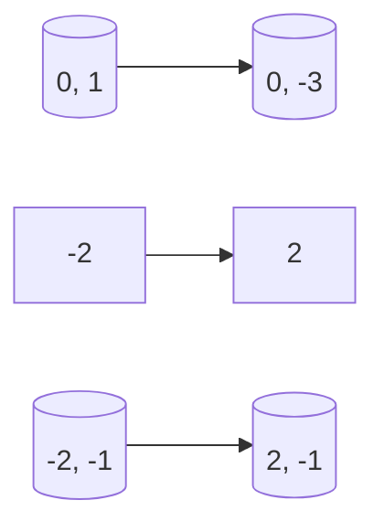

**Geometry and Computation**
==========================

**Introduction**
---------------

Geometry and computation are fundamental concepts that underlie many problems in computer science, mathematics, and engineering. This note will cover the essential principles, formulas, and techniques required to tackle questions related to geometry and computation.

**Core Concepts**
-----------------

### Distance Formula

The distance between two points $(x_1, y_1)$ and $(x_2, y_2)$ in a 2D plane is given by:

$$d = \sqrt{(x_2 - x_1)^2 + (y_2 - y_1)^2}$$

This formula can be used to find the length of sides of polygons or other shapes.

### Area of Polygons

The area of a polygon with vertices $(x_i, y_i)$ for $i = 1, 2, \ldots, n$ is given by:

$$A = \frac{1}{2} | x_1y_2 + x_2y_3 + \ldots + x_ny_1 - y_1x_2 - y_2x_3 - \ldots - y_nx_1 |$$

This formula can be used to find the area of quadrilaterals, triangles, or other polygons.

### Shoelace Formula

The shoelace formula is a special case of the area formula for simple polygons. It is given by:

$$A = \frac{1}{2} | x_1y_2 + x_2y_3 + \ldots + x_ny_1 - y_1x_2 - y_2x_3 - \ldots - y_nx_1 |$$

This formula can be used to find the area of simple polygons.

### Midpoint Formula

The midpoint between two points $(x_1, y_1)$ and $(x_2, y_2)$ is given by:

$$(\frac{x_1 + x_2}{2}, \frac{y_1 + y_2}{2})$$

This formula can be used to find the coordinates of the midpoint between two points.

### Slope Formula

The slope between two points $(x_1, y_1)$ and $(x_2, y_2)$ is given by:

$m = \frac{y_2 - y_1}{x_2 - x_1}$

This formula can be used to find the slope of lines or other shapes.

**Key Formulas/Theorems**
-------------------------

### Area Formula for Quadrilaterals

The area of a quadrilateral with vertices $(x_i, y_i)$ for $i = 1, 2, \ldots, 4$ is given by:

$$A = | x_1y_2 + x_2y_3 + x_3y_4 + x_4y_1 - y_1x_2 - y_2x_3 - y_3x_4 - y_4x_1 |$$

### Shoelace Formula for Quadrilaterals

The shoelace formula for quadrilaterals is given by:

$$A = \frac{1}{2} | x_1y_2 + x_2y_3 + x_3y_4 + x_4y_1 - y_1x_2 - y_2x_3 - y_3x_4 - y_4x_1 |$$

### Distance Formula between Two Points

The distance between two points $(x_i, y_i)$ and $(x_j, y_j)$ is given by:

$$d = \sqrt{(x_j - x_i)^2 + (y_j - y_i)^2}$$

**Problem Solving Patterns**
---------------------------

### Finding the Area of a Quadrilateral

1. Plot the points on a graph.
2. Use the shoelace formula to find the area.

### Finding the Distance between Two Points

1. Plug in the coordinates into the distance formula.
2. Simplify and calculate the result.

**Examples with Solutions**
---------------------------

### Example 1: Find the Area of a Quadrilateral

Given:

* $(x_1, y_1) = (0, 1)$
* $(x_2, y_2) = (0, -3)$
* $(x_3, y_3) = (-2, -1)$
* $(x_4, y_4) = (2, -1)$

Solution:

Using the shoelace formula for quadrilaterals, we get:

$$A = \frac{1}{2} | x_1y_2 + x_2y_3 + x_3y_4 + x_4y_1 - y_1x_2 - y_2x_3 - y_3x_4 - y_4x_1 |$$

Plugging in the values, we get:

$$A = \frac{1}{2} | 0(-3) + 0(-1) + (-2)(-1) + (2)(1) - (1)(0) - (-3)(-2) - (-1)(2) - (-1)(0) |$$

Simplifying, we get:

$$A = \frac{1}{2} | 4 + 6 + 2 |$$

$$A = \frac{1}{2} | 12 |$$

$$A = 8$$

### Example 2: Find the Distance between Two Points

Given:

* $(x_i, y_i) = (0, 1)$
* $(x_j, y_j) = (4, 5)$

Solution:

Using the distance formula, we get:

$$d = \sqrt{(x_j - x_i)^2 + (y_j - y_i)^2}$$

Plugging in the values, we get:

$$d = \sqrt{(4-0)^2 + (5-1)^2}$$

Simplifying, we get:

$$d = \sqrt{16+16}$$

$$d = \sqrt{32}$$

$$d = 4\sqrt{2}$$

**Common Pitfalls**
-------------------

* Forgetting to simplify the expression when using the shoelace formula.
* Not using the correct formula for the area of a quadrilateral.

**Quick Summary**
-----------------

* The distance between two points $(x_i, y_i)$ and $(x_j, y_j)$ is given by: $d = \sqrt{(x_j - x_i)^2 + (y_j - y_i)^2}$
* The area of a quadrilateral with vertices $(x_i, y_i)$ for $i = 1, 2, \ldots, 4$ is given by: $A = | x_1y_2 + x_2y_3 + x_3y_4 + x_4y_1 - y_1x_2 - y_2x_3 - y_3x_4 - y_4x_1 |$
* The shoelace formula for quadrilaterals is given by: $A = \frac{1}{2} | x_1y_2 + x_2y_3 + x_3y_4 + x_4y_1 - y_1x_2 - y_2x_3 - y_3x_4 - y_4x_1 |$