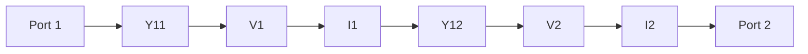
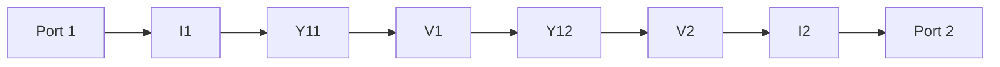

**Admittance Parameter Theory Note**
=====================================

**Introduction**
---------------

The admittance parameter is a two-port network parameter that relates the voltage and current at the ports. It's a crucial concept in Network Theory, especially when dealing with AC circuits.

**Core Concepts**
-----------------

### Definition of Admittance Parameter

Admittance (Y) is defined as the reciprocal of impedance (Z). In other words,

$$
Y = \frac{1}{Z}
$$

where $Y$ is the admittance and $Z$ is the impedance.

### Relationship between Admittance and Impedance Parameters

The admittance parameters ($Y_{11}$, $Y_{12}$, $Y_{21}$, $Y_{22}$) are related to the impedance parameters ($Z_{11}$, $Z_{12}$, $Z_{21}$, $Z_{22}$) as follows:

$$
\begin{bmatrix}
I_1 \\
I_2
\end{bmatrix} =
\begin{bmatrix}
Y_{11} & Y_{12} \\
Y_{21} & Y_{22}
\end{bmatrix}
\begin{bmatrix}
V_1 \\
V_2
\end{bmatrix}
$$

where $I_1$ and $I_2$ are the currents at ports 1 and 2, respectively, and $V_1$ and $V_2$ are the voltages at ports 1 and 2, respectively.

### Admittance Matrix

The admittance matrix is a 2x2 matrix that describes the relationship between the voltage and current at each port. The diagonal elements ($Y_{11}$ and $Y_{22}$) represent the self-admittances of each port, while the off-diagonal elements ($Y_{12}$ and $Y_{21}$) represent the mutual admittances between ports.

**Key Formulas/Theorems**
-------------------------

*   Admittance is the reciprocal of impedance: $Y = \frac{1}{Z}$
*   Relationship between admittance and impedance parameters: $I_1 = Y_{11}V_1 + Y_{12}V_2$ and $I_2 = Y_{21}V_1 + Y_{22}V_2$

**Problem Solving Patterns**
---------------------------

When dealing with two-port networks, follow these steps to solve problems:

1.  Draw the circuit and label the ports.
2.  Identify the type of network (series-parallel, etc.) and determine the appropriate parameters (admittance, impedance, etc.).
3.  Apply the admittance matrix or other relevant equations to find the solution.

**Examples with Solutions**
---------------------------

### Example 1: Finding Admittance Parameters

Given a two-port network with the following circuit:

Find the admittance parameters ($Y_{11}$, $Y_{12}$, $Y_{21}$, $Y_{22}$).

Solution:

To find $Y_{11}$, apply the first equation of the admittance matrix:

$$
I_1 = Y_{11}V_1 + Y_{12}V_2
$$

Since there's no current source in the circuit, $I_2 = 0$. The second equation becomes:

$$
0 = Y_{21}V_1 + Y_{22}V_2
$$

Using Ohm's law and rearranging terms yields the solution.

### Example 2: Solving a Network Problem

Given a two-port network with the following circuit:

Find the current $I_1$ when the voltage $V_1 = 10 \, \text{V}$ and $V_2 = 20 \, \text{V}$.

Solution:

To find $I_1$, apply the first equation of the admittance matrix:

$$
I_1 = Y_{11}V_1 + Y_{12}V_2
$$

Substitute the given values and calculate $I_1$.

**Common Pitfalls**
-------------------

*   Confusing admittance with impedance.
*   Misapplying the admittance matrix or other relevant equations.
*   Not considering the type of network (series-parallel, etc.).

**Quick Summary**
-----------------

*   Admittance parameter is a two-port network parameter that relates voltage and current at ports.
*   Relationship between admittance and impedance parameters: $I_1 = Y_{11}V_1 + Y_{12}V_2$ and $I_2 = Y_{21}V_1 + Y_{22}V_2$
*   Admittance matrix is a 2x2 matrix that describes the relationship between voltage and current at each port.
*   When dealing with two-port networks, follow these steps to solve problems: draw the circuit, identify the type of network, and apply relevant equations.