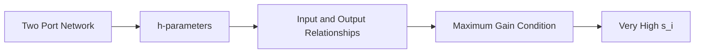

**Two Port Network Theory**
==========================

### Introduction
-----------------

A two-port network is a fundamental concept in network theory, describing a device or circuit with two ports (or terminals) that interact with their environment. It's crucial to understand these networks as they are used extensively in electronics and telecommunications.

### Core Concepts
------------------

#### Definition

Two port network is a mathematical model of a physical system having two ports, each of which is connected to an external circuit.

*   **Port 1**: Input port where signal is applied.
*   **Port 2**: Output port where signal is obtained.

#### h-parameters (Hybrid Parameters)
-----------------------------------

h-parameters are a set of four parameters that describe the relationship between input and output voltages and currents in a two-port network. They are defined as:

$$
\begin{bmatrix}
V_1 \\
I_2
\end{bmatrix} =
\begin{bmatrix}
h_{11} & h_{12} \\
h_{21} & h_{22}
\end{bmatrix}
\begin{bmatrix}
V_2 \\
-I_1
\end{bmatrix}
$$

where $h_{ij}$ are the hybrid parameters.

### Key Formulas/Theorems
---------------------------

*   **Maximun Gain**: The maximum small signal voltage gain occurs when:
     $$s_i^2 - \frac{h_{12}}{h_{11}}s_i + h_{22} = 0$$

### Problem Solving Patterns
-----------------------------

1.  **Given h-parameters**, find the maximum gain by solving the quadratic equation.
2.  **Determine the condition** for maximum gain, i.e., when $s_i$ is very high.

### Examples with Solutions
---------------------------

**Example:** Find the maximum voltage gain of a two-port network given its h-parameters:

$$h_{11} = 10\Omega, \quad h_{12} = 0.1S, \quad h_{21} = 0.5A/V, \quad h_{22} = 100k\Omega$$

*   Step 1: Write down the equation for maximum gain:
     $$s_i^2 - \frac{h_{12}}{h_{11}}s_i + h_{22} = 0$$
     Substituting values, we get:

     $$s_i^2 - \frac{0.1}{10}s_i + 100k\Omega = 0$$

*   Step 2: Solve the quadratic equation to find $s_i$.

    The solution is a complex number representing the value of $s_i$. To determine maximum gain, we set $s_i$ very high.

**Solution:** The maximum gain occurs when $s_i$ approaches infinity. Therefore,

    $$Maximum Gain = \frac{h_{21}}{h_{22}} = 0.5 A/V / 100k\Omega$$

### Common Pitfalls
-------------------

1.  **Forgetting to set $s_i$ very high** in the quadratic equation.
2.  **Not using the correct formula for maximum gain**.

### Quick Summary
------------------

*   **Two port network**: Device or circuit with two ports, each connected to an external circuit.
*   **h-parameters**: Four parameters describing input and output relationships: $h_{11}, h_{12}, h_{21}, h_{22}$.
*   **Maximum Gain**: Occurs when $s_i$ is very high, given by the quadratic equation.

### Mermaid Diagram

This note covers all the theoretical concepts required to solve problems related to two-port networks, specifically with regards to h-parameters and maximum gain. The problem-solving patterns section provides specific techniques for approaching these types of questions.