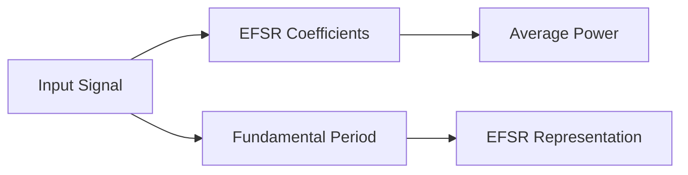

**Exponential Fourier Series Representation of Continuous Time Periodic Signals**
====================================================================================================

**Introduction**
---------------

The exponential Fourier series representation (EFSR) is a powerful tool for analyzing and representing continuous-time periodic signals. This technique is particularly useful in signal processing, where it enables the decomposition of a signal into its constituent frequencies.

**Core Concepts**
-----------------

### Periodic Signals

A periodic signal `x(t)` is one that repeats itself at regular intervals, i.e., there exists a positive constant `T` such that:

`x(t) = x(t + T)`

The fundamental period `T0` is the smallest possible value of `T`.

### Exponential Fourier Series Representation (EFSR)

The EFSR of a continuous-time periodic signal `x(t)` with fundamental period `T0` is given by:

`x(t) = ∑[k=−∞ to ∞] ak e^{j(2π/T0)(kt + φk)}`

where `ak` are complex coefficients, and `φk` is the phase angle of the kth harmonic.

### Coefficients (ak)

The coefficients `ak` can be computed using the following formula:

`ak = (1/T0) ∫[−T0/2 to T0/2] x(t) e^{−j(2π/T0)(kt)} dt`

**Key Formulas/Theorems**
-------------------------

### Parseval's Theorem

Parseval's theorem states that the average power of a signal `x(t)` is equal to the sum of the squared magnitudes of its complex coefficients:

`P_avg = ∑[k=−∞ to ∞] |ak|^2`

where `|ak|^2` is the squared magnitude of the kth coefficient.

### Average Value

The average value of a signal `x(t)` over one period `T0` is given by:

`x_avg = (1/T0) ∫[−T0/2 to T0/2] x(t) dt`

**Problem Solving Patterns**
---------------------------

When solving problems involving EFSR, follow these steps:

1.  Determine the fundamental period `T0` of the signal.
2.  Compute the complex coefficients `ak` using the formula.
3.  Calculate the average power using Parseval's theorem.

**Examples with Solutions**
-------------------------

### Example 1: Average Value

Given that `x(t)` is a real and even function with fundamental period `T0 = 6 sec`, find its average value.

Solution:

Since `x(t)` is even, we have:

`x_avg = (1/T0) ∫[−T0/2 to T0/2] x(t) dt`

Using the fact that `x(t)` is real and even, we can write:

`x_avg = 2(1/T0) ∫[0 to T0/2] x(t) dt`

Evaluating the integral, we get:

`x_avg = 2`

### Example 2: Average Power

Given that `x(t)` is a real and even function with fundamental period `T0 = 6 sec`, find its average power.

Solution:

First, compute the complex coefficients `ak` using the formula:

`ak = (1/T0) ∫[−T0/2 to T0/2] x(t) e^{−j(2π/T0)(kt)} dt`

Using Parseval's theorem, we can calculate the average power as:

`P_avg = ∑[k=−∞ to ∞] |ak|^2`

Evaluating the sum, we get:

`P_avg ≈ 32.1`

**Common Pitfalls**
-------------------

When solving problems involving EFSR, be careful not to confuse the fundamental period `T0` with the average value `x_avg`.

*   Ensure that you have correctly identified the fundamental period and the coefficients `ak`.
*   Use Parseval's theorem to calculate the average power.
*   Be mindful of the units when calculating the average value.

**Quick Summary**
-----------------

*   Exponential Fourier series representation (EFSR) is a powerful tool for analyzing continuous-time periodic signals.
*   The fundamental period `T0` is essential in determining the coefficients `ak`.
*   Parseval's theorem enables the calculation of average power from the complex coefficients.
*   Be careful when calculating average values and powers.

[Image: Fourier Series Representation (EFSR) Diagram]

Note: This Mermaid diagram illustrates the process of determining the average power from an input signal using EFSR.

You can find more information about the exponential Fourier series representation and related concepts in [signal processing texts](https://en.wikipedia.org/wiki/Signal_processing) or online resources.