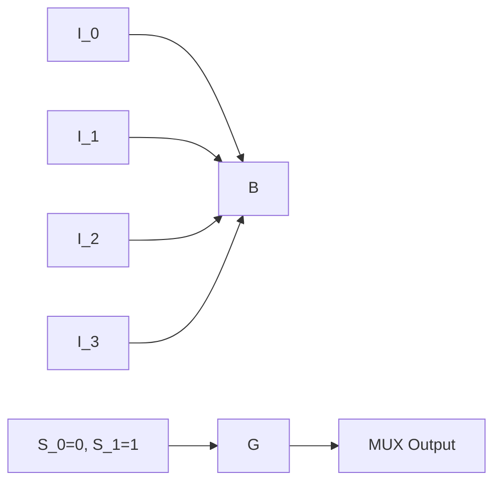

# Multiplexers and Demultiplexers
## Introduction
Multiplexers (MUX) and demultiplexers (DEMUX) are fundamental components in digital electronics used for data transfer. A multiplexer combines multiple input signals into a single output signal, while a demultiplexer separates a single input signal into multiple output signals.

## Core Concepts

A multiplexer is a logic circuit that takes multiple input signals and selects one of them to pass through to the output based on a set of select lines. The number of select lines determines the number of inputs and outputs the multiplexer can handle.

### Types of Multiplexers
There are two main types of multiplexers:

1. **2-to-1 MUX**: Selects between two input signals.
2. **4-to-1 MUX**: Selects between four input signals (as seen in the GATE 2020 question).

The figure below shows a 4-to-1 multiplexer:
```mermaid
graph LR
A[Input 1] --> B
C[Input 2] --> B
D[Input 3] --> B
E[Input 4] --> B
F[Select Lines (S0, S1)] --> G
G --> H[MUX Output]
```
## Key Formulas/Theorems

The output function of a multiplexer can be expressed as:

$$ F = P \cdot Q \cdot R_{\overline{S_0}} + P \cdot Q \cdot R_{S_0} + P \cdot \overline{Q} \cdot R_{\overline{S_1}} + P \cdot \overline{Q} \cdot R_{S_1} $$

where $P$, $Q$, and $R$ are the input signals, $S_0$ and $S_1$ are the select lines, and $\overline{S}$ denotes the complement of $S$.

## Problem Solving Patterns
To solve multiplexer problems:

1. Identify the number of inputs and outputs.
2. Determine the type of multiplexer (2-to-1 or 4-to-1).
3. Analyze the select lines to determine which input signal is passed through to the output.
4. Use the output function formula to derive the final expression.

## Examples with Solutions

### Example 1
A 4-to-1 multiplexer has inputs $I_0$, $I_1$, $I_2$, and $I_3$ and select lines $S_0$ and $S_1$. If $S_0 = 0$ and $S_1 = 1$, what is the output function?



Using the output function formula, we get:

$$ F = P \cdot Q \cdot R_{\overline{S_0}} + P \cdot Q \cdot R_{S_0} + P \cdot \overline{Q} \cdot R_{\overline{S_1}} + P \cdot \overline{Q} \cdot R_{S_1} $$

$$ F = I_2 $$

### Example 2
A 4-to-1 multiplexer has inputs $I_0$, $I_1$, $I_2$, and $I_3$ and select lines $S_0$ and $S_1$. If $S_0 = 1$ and $S_1 = 0$, what is the output function?

Using the same formula, we get:

$$ F = P \cdot Q \cdot R_{\overline{S_0}} + P \cdot Q \cdot R_{S_0} + P \cdot \overline{Q} \cdot R_{\overline{S_1}} + P \cdot \overline{Q} \cdot R_{S_1} $$

$$ F = I_3 $$

## Common Pitfalls
Students often miss the following:

* Understanding the type of multiplexer and its implications on the output function.
* Analyzing the select lines to determine which input signal is passed through to the output.
* Using the correct formula for the output function.

## Quick Summary
* A multiplexer combines multiple input signals into a single output signal based on select lines.
* The number of select lines determines the type of multiplexer (2-to-1 or 4-to-1).
* The output function can be expressed as: $ F = P \cdot Q \cdot R_{\overline{S_0}} + P \cdot Q \cdot R_{S_0} + P \cdot \overline{Q} \cdot R_{\overline{S_1}} + P \cdot \overline{Q} \cdot R_{S_1} $
* Analyze the select lines and use the output function formula to derive the final expression.