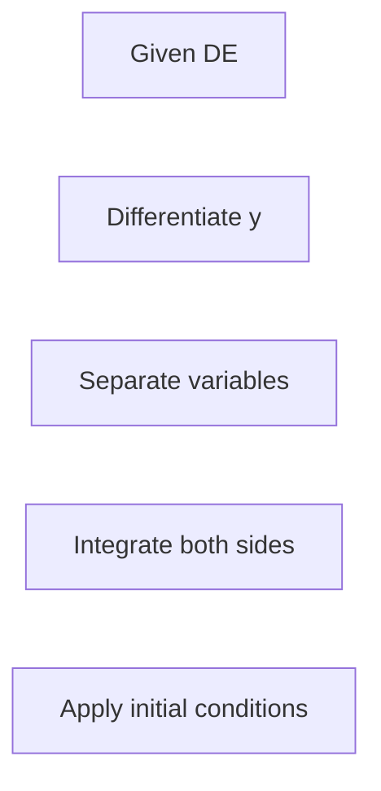

**Solving Differential Equations**
=====================================

### Introduction
---------------

Differential equations are a fundamental tool in physics, engineering, and mathematics for modeling real-world phenomena. Solving differential equations requires an understanding of various techniques, including separation of variables, substitution, and integrating factors.

### Core Concepts
------------------

#### Types of Differential Equations

* **Linear**: Can be written in the form $a(x)y'' + b(x)y' + c(x)y = f(x)$.
* **Non-Linear**: Does not fit the above form.
* **Homogeneous**: When $f(x) = 0$.

#### Solution Techniques

* **Separation of Variables**: Used for homogeneous differential equations with one independent variable.
* **Substitution Method**: Used for non-homogeneous differential equations or when separation of variables fails.
* **Integrating Factors**: Used to solve linear differential equations.

### Key Formulas/Theorems
---------------------------

* **The Auxiliary Equation**:
$\left( \frac{d^2y}{dx^2} - p(x) \frac{dy}{dx} + q(x)y = 0 \right)$
$\Rightarrow (m^2 - p(x)m + q(x)) = 0$
* **Solution of the Auxiliary Equation**
$m_{1,2} = \frac{p(x) \pm \sqrt{p^2(x) - 4q(x)}}{2}$

### Problem Solving Patterns
---------------------------

#### Example from Source Question (ec_2020_7)

1. Differentiate $y$ with respect to $x$: $\frac{d^2y}{dx^2}$
2. Rearrange the equation: $\left( \frac{dy}{dx} \right)^2 - y \frac{d^2y}{dx^2} = 0$
3. Separate variables: $\frac{dy}{dx} = y \frac{d^2y}{dx^2}$ or $y^{-1} dy = \left( \frac{d^2y}{dx^2} \right)^{-1} dx$
4. Integrate both sides:
$\int y^{-1} dy = \int \left( \frac{d^2y}{dx^2} \right)^{-1} dx$
5. Apply initial conditions

### Examples with Solutions
---------------------------

* **Example 1**: Solve $y' + 3x^2 y = x^4$.
	+ Differentiate $y$: $y' = x^4 - 3x^2 y$
	+ Rearrange the equation: $\frac{dy}{dx} = x^4 - 3x^2 y$
	+ Separate variables: $\frac{1}{x^4 - 3x^2 y} dy = dx$
	+ Integrate both sides:
$\int \left( \frac{1}{x^4 - 3x^2 y} \right) dy = \int dx$
* **Example 2**: Solve $y'' + x y' = 0$.
	+ Differentiate $y$: $y'' = -x y'$
	+ Rearrange the equation: $\frac{d^2y}{dx^2} = -x \frac{dy}{dx}$
	+ Separate variables: $\left( \frac{1}{\frac{dy}{dx}} \right) d^2y = dx$

### Common Pitfalls
-------------------

* **Incorrect application of separation of variables**: Ensure that the equation is homogeneous and has one independent variable.
* **Missing integrating factor**: In linear differential equations, an integrating factor may be necessary to solve the equation.

### Quick Summary
---------------

* Understand types of differential equations (linear, non-linear, homogeneous).
* Familiarize yourself with solution techniques (separation of variables, substitution method, integrating factors).
* Apply key formulas and theorems (auxiliary equation, solution of auxiliary equation).
* Practice problem solving patterns using examples from source questions.

Note: This comprehensive theory note aims to provide a thorough understanding of differential equations. However, practice problems are essential for mastering the concepts.