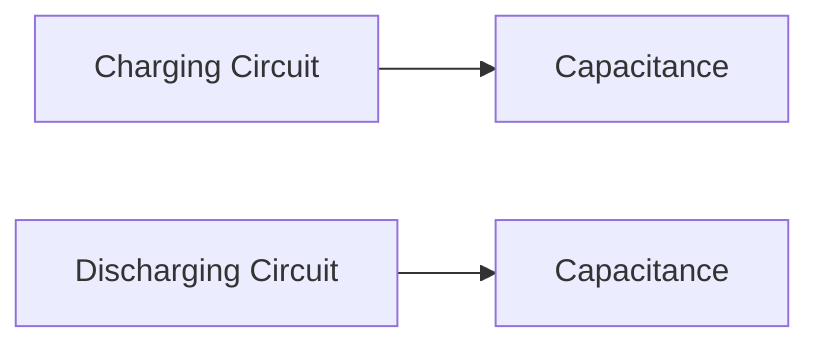

**Capacitor Charging and Discharging Theory Note**
======================================================

### Introduction
-----------------

In analog electronics, capacitors play a crucial role in filtering, coupling, and impedance matching. Understanding how they charge and discharge is essential for analyzing circuit behavior and designing reliable electronic systems.

### Core Concepts
------------------

*   **Capacitance**: The ability of a capacitor to store electric charge. Measured in Farads (F).
*   **Voltage Across the Capacitor**: The difference between the voltages at the two terminals of the capacitor.
*   **Current Through the Capacitor**: The flow of electrons from one terminal to the other.

### Key Formulas/Theorems
---------------------------

*   **Capacitance Formula**:

    $$C = \frac{Q}{V}$$

    where $C$ is capacitance, $Q$ is charge, and $V$ is voltage across the capacitor.
*   **Charge of a Capacitor**:

    $$Q = CV$$
*   **Time Constant (τ)**:

    $$\tau = RC$$

    where $R$ is resistance and $C$ is capacitance.

### Problem Solving Patterns
-----------------------------

1.  **Identify the Type of Capacitor**: Determine if it's a charging or discharging capacitor.
2.  **Apply the Relevant Formula**: Choose the correct formula based on the type of capacitor and the given information.
3.  **Use the Time Constant (τ)**: Consider the time constant when analyzing circuits with multiple components.

### Examples with Solutions
---------------------------

#### Example 1

A capacitor is connected in series to a resistor. The initial voltage across the capacitor is 0 V, and the resistance value is 10 kΩ. If the capacitance is 100 μF, what will be the time constant (τ) of the circuit?

Solution:

$$\tau = RC = 10 \text{ k} \Omega \times 100 \text{ } \mu\text{F} = 1 \text{ s}$$

#### Example 2

A capacitor is discharging through a resistor. The initial voltage across the capacitor is 5 V, and the resistance value is 20 kΩ. If the capacitance is 50 μF, what will be the time constant (τ) of the circuit?

Solution:

$$\tau = RC = 20 \text{ k} \Omega \times 50 \text{ } \mu\text{F} = 1 \text{ s}$$

### Common Pitfalls
-------------------

*   **Ignoring Initial Conditions**: Failing to consider the initial voltage across the capacitor when analyzing charging or discharging circuits.
*   **Incorrect Application of Formulas**: Misapplying formulas, such as using the charge formula instead of the capacitance formula.

### Quick Summary
------------------

*   Capacitance (C): The ability of a capacitor to store electric charge.
*   Voltage Across the Capacitor: Difference between voltages at the two terminals.
*   Current Through the Capacitor: Flow of electrons from one terminal to the other.
*   Time Constant (τ): Product of resistance and capacitance.

### Mermaid Diagram

This theory note covers the essential concepts, formulas, and problem-solving strategies for capacitor charging and discharging. By following this guide, you'll be well-prepared to tackle questions on this topic in the GATE CS exam.