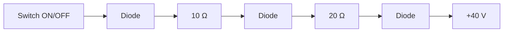

**Diode Circuit Analysis**
=========================

**Introduction**
---------------

A diode circuit is a network of diodes, resistors, and possibly other components that analyze the behavior of diodes under various conditions. Understanding diode circuits is essential for designing and analyzing electronic circuits.

**Core Concepts**
-----------------

### Diode Operation

A diode is a two-terminal semiconductor device that allows current to flow in one direction but blocks it in the opposite direction. The anode is the positive terminal, while the cathode is the negative terminal. When the anode voltage is greater than the cathode voltage (forward bias), the diode conducts and has a low resistance. Conversely, when the anode voltage is less than the cathode voltage (reverse bias), the diode does not conduct and has a high resistance.

### Ideal Diodes

In circuit analysis, ideal diodes are assumed to have zero resistance in the forward-biased direction and infinite resistance in the reverse-biased direction. This simplification allows for easier analysis of complex circuits.

**Key Formulas/Theorems**
------------------------

*   The **KVL (Kirchhoff's Voltage Law)** equation states that the sum of voltage changes around any closed loop in a circuit must equal zero: $\sum V = 0$
*   The **Ohm's law** for diodes is given by $I_D = I_s \left( e^{\frac{V_D}{nV_T}} - 1 \right)$, where $I_D$ is the diode current, $I_s$ is the reverse saturation current, $V_D$ is the voltage across the diode, and $n$ is the ideality factor.

**Problem Solving Patterns**
---------------------------

*   **Voltage analysis**: Start by applying KVL to determine the voltage drops across each component in the circuit.
*   **Current analysis**: Use Ohm's law for diodes or other components to determine the current flow through each element.
*   **Switching behavior**: Analyze how the switch affects the circuit, including when it is ON and OFF.

**Examples with Solutions**
---------------------------

### Example 1:

Consider a simple diode circuit with an ideal diode $D$, a 10 $\Omega$ resistor $R$, and a voltage source $V_S$. The circuit is described as follows:

```mermaid
graph LR
    V_S[+20 V] --> R[10 Ω] -->
    D[Ideal Diode] -->
```

Solve for the current flow through the diode when the switch is ON.

Solution: Using KVL, we have $V_{R} + V_D = 0$. Since the diode is ideal and conducting, $V_D = 0$, so $V_R = -20 V$. Applying Ohm's law, we find that $I_D = \frac{V_S}{R} = \frac{-20}{10} = -2 A$.

### Example 2:

Consider the circuit shown in the source question Q1 (ID: ee\_2023\_44).



Determine the truth statements regarding diode conduction when the switch is ON or OFF.

Solution: When the switch is ON, D1 conducts and both D2 and D3 are reverse-biased. Conversely, when the switch is OFF, D1 is reverse-biased and both D2 and D3 conduct.

**Common Pitfalls**
------------------

*   **Incorrect assumption of diode behavior**: Be mindful of the ideal diode model and its limitations.
*   **Forgetting to consider the switch state**

**Quick Summary**
-----------------

*   Understand diode operation (conduction, reverse bias)
*   Apply KVL for voltage analysis
*   Use Ohm's law for current analysis
*   Analyze switching behavior