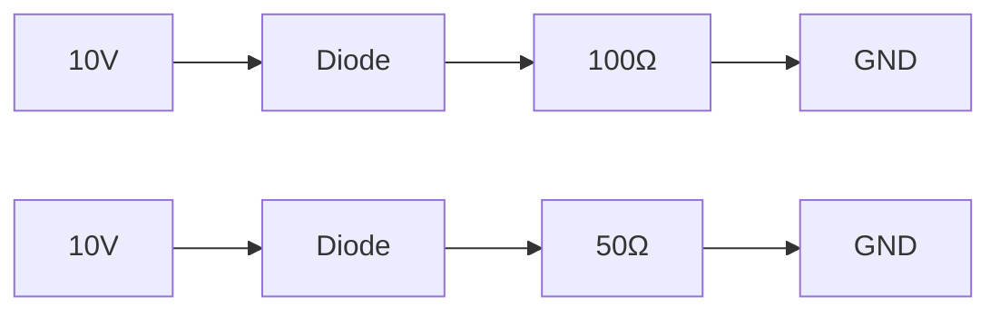
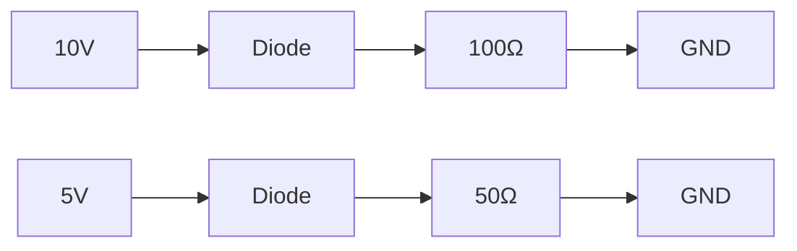

# Diode Family
=====================================

## Introduction
---------------

Diodes are a fundamental component in analog electronics, and understanding their behavior is crucial for designing and analyzing electronic circuits. The diode family consists of various types of diodes that differ in their characteristics, such as rectification, switching, and voltage regulation.

## Core Concepts
-----------------

### Ideal Diodes

Ideal diodes have the following properties:

* **Zero resistance** when forward-biased (ON)
* **Infinite resistance** when reverse-biased (OFF)

This simplifies the analysis of circuits containing diodes, as we can assume that the current flows freely through the ON diode and zero current flows through the OFF diode.

### Real Diodes

Real diodes have non-ideal characteristics, including:

* **Forward voltage drop** ($V_F$): The minimum voltage required to turn on a diode
* **Reverse saturation current** ($I_S$): The small current that flows through a reverse-biased diode
* **Junction capacitance**: A small capacitor that affects high-frequency behavior

These characteristics can be modeled using the Shockley diode equation:

$$I_D = I_S \left( e^{\frac{V_D}{n V_T}} - 1 \right)$$

where $I_D$ is the diode current, $V_D$ is the voltage across the diode, $n$ is a constant (typically around 1-2), and $V_T$ is the thermal voltage ($\approx 25.85$ mV at room temperature).

## Key Formulas/Theorems
-------------------------

### Diode Current Equation

$$I_D = I_S \left( e^{\frac{V_D}{n V_T}} - 1 \right)$$

### Node Analysis

To solve circuits with diodes, we can apply node analysis. For a circuit with multiple nodes, we can write the node equations using Kirchhoff's current law:

$$\sum_{i=1}^N I_i = 0$$

where $I_i$ is the current entering or leaving node $i$, and $N$ is the number of nodes.

## Problem Solving Patterns
---------------------------

### Case Analysis

When solving problems with diodes, it's essential to consider different cases, such as:

* **Both diodes ON**: Assume both diodes are conducting and apply Kirchhoff's laws.
* **One diode ON, one OFF**: Assume only the forward-biased diode is conducting and apply Kirchhoff's laws.

### Node Analysis

To solve circuits with multiple nodes, we can apply node analysis. For a circuit with multiple nodes, we can write the node equations using Kirchhoff's current law:

$$\sum_{i=1}^N I_i = 0$$

## Examples with Solutions
---------------------------

### Example 1: Ideal Diode Circuit

Given circuit:

Solve for the current through each diode.

Solution:

* Both diodes are ON, so we can apply Kirchhoff's laws:
$$I_1 = \frac{10}{100} = 0.1A$$
$$I_2 = \frac{10}{50} = 0.2A$$

### Example 2: Real Diode Circuit

Given circuit:

Solve for the current through each diode.

Solution:

* Both diodes are ON, so we can apply Kirchhoff's laws:
$$I_1 = \frac{10}{100} = 0.1A$$
$$I_2 = \frac{5}{50} = 0.1A$$

## Common Pitfalls
------------------

* Assuming ideal diodes when real diodes are used.
* Not considering different cases, such as both diodes ON or one OFF.

## Quick Summary
-----------------

* Ideal diodes have zero resistance when forward-biased and infinite resistance when reverse-biased.
* Real diodes have non-ideal characteristics, including forward voltage drop and reverse saturation current.
* Apply node analysis using Kirchhoff's laws to solve circuits with multiple nodes.
* Consider different cases, such as both diodes ON or one OFF.