**Op-Amp Theory Notes**
=======================

### Introduction
-----------------

An Operational Amplifier (Op-Amp) is a high-gain electronic voltage amplifier with differential inputs and, typically, a single output. In this note, we'll cover the theoretical concepts, formulas, and problem-solving patterns required to tackle Op-Amp related questions.

### Core Concepts
-----------------

*   **Ideal Op-Amp:** An ideal Op-Amp has infinite gain, zero input offset voltage, and infinite CMRR (Common Mode Rejection Ratio).
*   **Input Resistance:** High input resistance ensures minimal loading on the input signal.
*   **Output Resistance:** Low output resistance allows for easy connection to subsequent circuits.

### Key Formulas/Theorems
-------------------------

LaTeX used for math:

$$V_o = A(v_1 - v_2)$$

where $A$ is the open-loop gain of the Op-Amp, and $v_1$ and $v_2$ are the input voltages.

For a difference amplifier (as seen in Q1), the formula simplifies to:

$$V_o = A\frac{R_f}{R_i}(v_1 - v_2)$$

where $R_f$ is the feedback resistor, and $R_i$ is the input resistor.

### Problem Solving Patterns
---------------------------

1.  **Identify the Op-Amp circuit type:** Understand whether it's a basic amplifier, an integrator, or a differentiator.
2.  **Determine the CMRR value:** Given that the ideal Op-Amp has infinite CMRR, non-ideal behavior is typically caused by resistances and capacitances in the input stage.
3.  **Solve for output voltage (V_o):** Apply the relevant formula based on the circuit type.

### Examples with Solutions
---------------------------

Let's solve Q1:

```markdown
Q1:
A difference amplifier is shown in the figure.  Assume the op-amp to be ideal.  The CMRR (in dB) of 
the difference amplifier is ________ (rounded off to 2 decimal places).
```

Assuming an ideal Op-Amp, we can ignore the non-ideal effects for now.

Given circuit:

```mermaid
graph LR
A[101k Ω] --> B[V_in1]
C[10.5k Ω] --> D[-V_in2]
E[9.5 k Ω] --> F[V_out]
G[A] --> H[101.5 k Ω]
```



Using the difference amplifier formula:

$$V_o = A\frac{R_f}{R_i}(v_1 - v_2)$$

Since $A$ is infinite (ideal Op-Amp), we can simplify to:

$$V_o = \frac{R_f}{R_i}(v_1 - v_2)$$

For this problem, the CMRR is not explicitly needed. However, if you need to calculate it for a non-ideal Op-Amp, use:

$$CMRR = 20\log\left(\frac{\Delta R}{R}\right)$$

where $\Delta R$ is the difference between the two input resistances.

### Common Pitfalls
-------------------

*   **Forgetting to consider non-ideal effects:** When dealing with real-world Op-Amps, don't ignore the effects of finite CMRR and temperature drift.
*   **Incorrect application of formulas:** Make sure you're using the correct formula for each circuit type.

### Quick Summary
-----------------

*   Ideal Op-Amp: Infinite gain, zero input offset voltage, infinite CMRR
*   Difference amplifier formula: $V_o = A\frac{R_f}{R_i}(v_1 - v_2)$
*   Non-ideal effects: Consider finite CMRR and temperature drift

This note covers the essential concepts for solving Op-Amp related questions. By mastering these ideas, you'll be well-prepared to tackle even more complex problems in Analog Electronics!